# 🏗️ FIRMEZA - Sistema de Gestión y Despacho de Materiales de Construcción

> **Guía Oficial del Proyecto, Manual de Arquitectura & Guía de Despliegue**  
> Diseñado para comprender en profundidad la arquitectura de software, patrones de diseño, diagramas técnicos (ER y Clases), flujo de datos, seguridad y ejecución tanto en entorno local como en contenedores Docker.

---

## 📌 Tabla de Contenidos
1. [Visión General del Proyecto](#-visión-general-del-proyecto)
2. [Arquitectura de la Solución (Clean Architecture, Use Cases & SOLID)](#-arquitectura-de-la-solución-clean-architecture-use-cases--solid)
3. [Capa de Aplicación y Casos de Uso (Use Cases)](#-capa-de-aplicación-y-casos-de-uso-use-cases)
4. [Estructura del Proyecto y Capas](#-estructura-del-proyecto-y-capas)
5. [Módulo ASP.NET Core Web API (Firmeza.Api)](#-módulo-aspnet-core-web-api-firmezaapi)
6. [Diagramas Técnicos de Arquitectura y Diseño](#-diagramas-técnicos-de-arquitectura-y-diseño)
   * [Diagrama de Clases y Casos de Uso](#diagrama-de-clases-y-casos-de-uso)
   * [Diagrama Entidad-Relación (ER) Completo](#diagrama-entidad-relación-er-completo)
   * [Diagrama de Secuencia (Flujo de Autenticación y Dashboard)](#diagrama-de-secuencia-flujo-de-autenticación-y-dashboard)
7. [Patrón Repository y Unit of Work (Acceso a Datos Desacoplado)](#-patrón-repository-y-unit-of-work-acceso-a-datos-desacoplado)
8. [Módulo de Gestión de Productos (CRUD, ViewModels y Filtrado)](#-módulo-de-gestión-de-productos-crud-viewmodels-y-filtrado)
9. [Módulo de Gestión de Clientes (CRUD, Validaciones y Búsqueda)](#-módulo-de-gestión-de-clientes-crud-validaciones-y-búsqueda)
10. [Módulo de Importación y Normalización de Excel con EPPlus](#-módulo-de-importación-y-normalización-de-excel-con-epplus)
11. [Módulo de Exportación de Datos y Comprobantes PDF (QuestPDF & EPPlus)](#-módulo-de-exportación-de-datos-y-comprobantes-pdf-questpdf--epplus)
12. [Mapeo de Objetos y DTOs con AutoMapper](#-mapeo-de-objetos-y-dtos-con-automapper)
13. [Manejo de Errores con Try-Catch y Validaciones de Entrada](#-manejo-de-errores-con-try-catch-y-validaciones-de-entrada)
14. [Seguridad y Control de Acceso (RBAC)](#-seguridad-y-control-de-acceso-rbac)
15. [Diseño Visual, UI/UX y Frontend (Header, Sidebar y Footer)](#-diseño-visual-uiux-y-frontend-header-sidebar-y-footer)
16. [Pruebas Unitarias Automatizadas (xUnit & Moq)](#-pruebas-unitarias-automatizadas-xunit--moq)
17. [Guía de Puesta en Marcha (Instalación y Ejecución Local)](#-guía-de-puesta-en-marcha-instalación-y-ejecución-local)
18. [Despliegue y Ejecución con Docker y Docker Compose](#-despliegue-y-ejecución-con-docker-y-docker-compose)
19. [Cuentas y Datos Semilla por Defecto (Seeders)](#-cuentas-y-datos-semilla-por-defecto-seeders)
20. [Guía Paso a Paso para Pruebas de Extremo a Extremo (Validación E2E para Evaluadores y TL)](#-guía-paso-a-paso-para-pruebas-de-extremo-a-extremo-validación-e2e-para-evaluadores-y-tl)
21. [Banco de Preguntas Clave para Sustentación y Estudio](#-banco-de-preguntas-clave-para-sustentación-y-estudio)

---

## 🏢 Visión General del Proyecto

**Firmeza** es una plataforma integral desarrollada para empresas del sector de la construcción, distribuidores mayoristas de materiales pesados y ferreterías industriales. Permite administrar:
- **Catálogo de Materiales y Productos:** Control de precios unitarios, unidades de medida (Bolsa, M3, Millar, Unidad, Kg), stock en tiempo real y bajas lógicas para conservar balances históricos.
- **Directorio de Clientes:** Gestión de empresas constructoras, contratistas y clientes particulares con validación estricta de Documento/NIT y protección de integridad referencial.
- **Registro y Despacho de Ventas:** Trazabilidad de órdenes con estados de entrega (`Pendiente`, `En Ruta`, `Entregado`) y congelación de precios históricos de venta.
- **Panel Administrativo (Dashboard):** Métricas operativas en tiempo real (facturación total acumulada, órdenes por estado y alertas de inventario bajo `< 50` unidades).
- **Múltiples Clientes y Servicios:** Servidor web **ASP.NET Core Razor MVC**, API REST desacoplada **ASP.NET Core Web API (`Firmeza.Api`)** y cliente interactivo **Angular 22 (SPA)**.

---

## 🏛️ Arquitectura de la Solución (Clean Architecture, Use Cases & SOLID)

El proyecto sigue rigurosamente los principios de **Clean Architecture** (Arquitectura Limpia / Onion Architecture) propuesta por Robert C. Martin y **Domain-Driven Design (DDD)** simplificado.

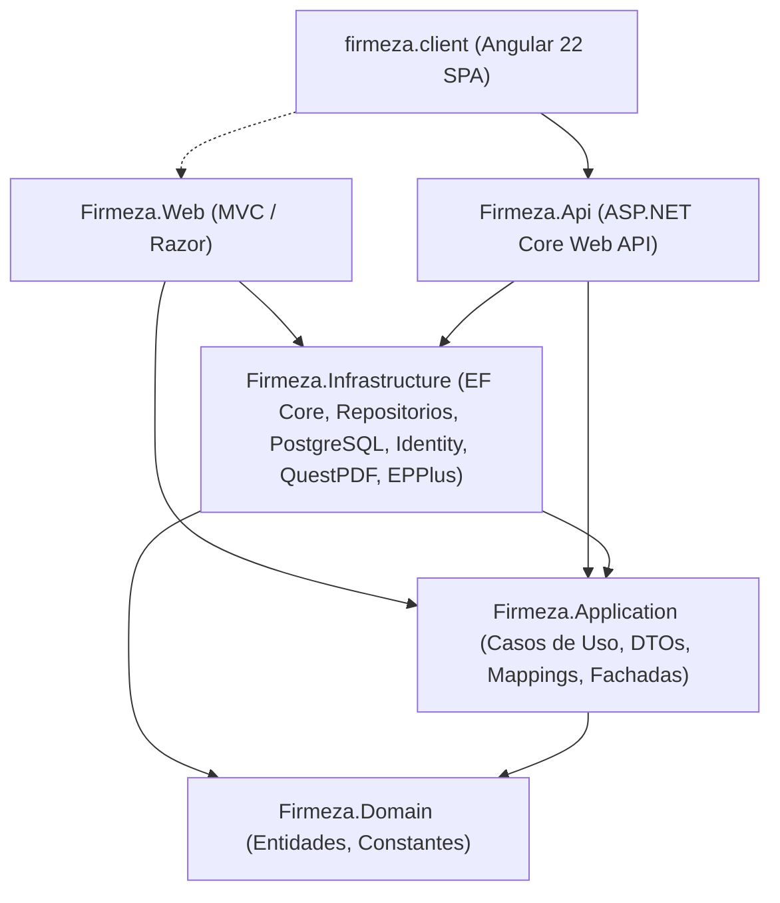

### 🧠 Principios y Ventajas de la Arquitectura:
1. **Independencia de Frameworks y Base de Datos:** Las reglas de negocio no conocen PostgreSQL ni ASP.NET; están aisladas en `Domain` y `Application`.
2. **Inversión de Dependencias (DIP):** Las capas internas definen las interfaces (contratos de repositorios y servicios) y las capas externas (`Infrastructure`) las implementan.
3. **Casos de Uso (Single Responsibility Principle):** Cada acción del usuario o flujo operativo está encapsulado en un Caso de Uso independiente y testeable.
4. **Múltiples Puntos de Entrada:** Tanto la Web MVC (`Firmeza.Web`) como la API REST (`Firmeza.Api`) reutilizan los mismos Casos de Uso y la misma base de datos PostgreSQL.
5. **Separación de Responsabilidades (SoC):** Cada proyecto resuelve una única preocupación técnica (Dominio, Casos de Uso, Persistencia o UI).
6. **Alta Testabilidad (Mocking):** Los Casos de Uso y servicios consumen `IUnitOfWork` e `IRepository`, facilitando pruebas unitarias sin tocar la base de datos real.

---

## ⚡ Capa de Aplicación y Casos de Uso (Use Cases)

Para garantizar un diseño limpio y **sin redundancias**, la lógica de aplicación se organiza en **Casos de Uso específicos por acción**, acompañados por servicios de aplicación (fachadas) que ofrecen compatibilidad y cohesión:

### 🛠️ Casos de Uso Implementados:
- **Productos (`Firmeza.Application.UseCases.Productos`):**
  - `CrearProductoUseCase`: Crea productos, asigna identificadores únicos, normaliza campos de texto y persiste con `IUnitOfWork`.
  - `ActualizarProductoUseCase`: Modifica precios, stock y datos descriptivos del catálogo.
  - `EliminarProductoUseCase`: Aplica la regla de negocio: si el producto tiene ventas asociadas ejecuta un **Soft Delete** (`Activo = false`); si no tiene ventas, lo elimina físicamente.
  - `ObtenerProductosUseCase`: Consultas filtradas, búsqueda por ID, verificación de existencia y catálogo de unidades de medida.
- **Clientes (`Firmeza.Application.UseCases.Clientes`):**
  - `CrearClienteUseCase`: Registro de nuevos clientes validando documento y datos de contacto.
  - `ActualizarClienteUseCase`: Actualización de información de despacho y contacto.
  - `EliminarClienteUseCase`: Valida que el cliente no tenga órdenes históricas antes de permitir la eliminación.
  - `ObtenerClientesUseCase`: Consultas con acumulado de compras, filtrado y validación de unicidad de NIT/documento.
- **Ventas (`Firmeza.Application.UseCases.Ventas`):**
  - `CrearVentaUseCase`: Valida cliente e ítems, congela precios históricos, descuenta automáticamente existencias en stock, persiste la transacción atómica e invoca la generación de recibos PDF.
  - `ObtenerVentasUseCase`: Consultas multi-criterio, búsqueda por cliente/material y ordenamientos.
  - `ActualizarEstadoDespachoUseCase`: Actualización de trazabilidad (`Pendiente`, `En Ruta`, `Entregado`).
- **Dashboard (`Firmeza.Application.UseCases.Dashboard`):**
  - `ObtenerDashboardMetricsUseCase`: Cálculo de totales financieros, órdenes por estado y detección de alertas de bajo stock.

---

## 📂 Estructura del Proyecto y Capas

```text
Firmeza/
│
├── Dockerfile.tests             # Dockerfile para ejecución de pruebas unitarias (xUnit)
├── Dockerfile.admin             # Dockerfile en producción para Firmeza.Admin (Razor Pages)
├── Dockerfile.api               # Dockerfile en producción para Firmeza.Api (ASP.NET Core Web API)
├── Dockerfile.client            # Dockerfile en producción para Firmeza.Client (Angular 22 + Nginx)
├── docker-compose.yml           # Orquestación Multi-Contenedor (tests gate + db + api + admin + client)
├── Firmeza.slnx                 # Archivo de solución .NET
├── README.md                    # Documentación oficial y manual técnico
│
├── src/                         # Backend (.NET 10.0 / C# 13)
│   ├── Firmeza.Domain/          # Núcleo del Negocio (Cero dependencias externas)
│   │   ├── Entities/            # Cliente, Producto, Venta, VentaDetalle
│   │   ├── Constants/           # Roles (Administrador, Cliente)
│   │   └── Shared/              # BaseEntity (Id)
│   │
│   ├── Firmeza.Application/     # Casos de Uso, DTOs, Mappings, Fachadas e Interfaces
│   │   ├── UseCases/            # Casos de Uso del Sistema (Arquitectura Limpia)
│   │   │   ├── Productos/       # CrearProductoUseCase, ActualizarProductoUseCase, EliminarProductoUseCase, ObtenerProductosUseCase
│   │   │   ├── Clientes/        # CrearClienteUseCase, ActualizarClienteUseCase, EliminarClienteUseCase, ObtenerClientesUseCase
│   │   │   ├── Ventas/          # CrearVentaUseCase, ObtenerVentasUseCase, ActualizarEstadoDespachoUseCase
│   │   │   └── Dashboard/       # ObtenerDashboardMetricsUseCase
│   │   ├── Mappings/            # Perfiles de AutoMapper (ProductoMappingProfile, ClienteMappingProfile, VentaMappingProfile)
│   │   ├── Services/            # Fachadas de Aplicación (ProductoService, ClienteService, VentaService, DashboardService)
│   │   ├── DTOS/                # Clientes, Productos, Ventas, Dashboard, Auth, Importacion
│   │   ├── Interfaces/          # IAuthService, IDashboardService, IClienteService, IProductoService, IVentaService, IExportService, IExcelImportService
│   │   │   └── Repositories/    # IBaseRepository, IClienteRepository, IProductoRepository, IVentaRepository, IUnitOfWork
│   │   ├── Validators/          # ValidadorEdad (Validaciones defensivas)
│   │   └── DependencyInjection.cs # Registro IoC de Use Cases, AutoMapper y Servicios
│   │
│   ├── Firmeza.Infrastructure/  # Persistencia, Repositorios e Integraciones Externas
│   │   ├── Persistence/         # ApplicationDbContext, DataSeeder, Configuraciones EF Core
│   │   ├── Repositories/        # BaseRepository, ClienteRepository, ProductoRepository, VentaRepository, UnitOfWork
│   │   ├── Services/            # ExportService (QuestPDF/EPPlus), ExcelImportService (EPPlus)
│   │   ├── Identity/            # IdentitySeeder, AuthService (ASP.NET Core Identity & RBAC)
│   │   └── DependencyInjection.cs # Configuración de DbContext, Repositorios e Identity
│   │
│   ├── Firmeza.Api/             # API REST Externa (ASP.NET Core Web API)
│   │   ├── Controllers/         # ProductosApiController, ClientesApiController, VentasApiController, DashboardApiController, ImportacionApiController, AuthApiController
│   │   ├── Properties/          # launchSettings.json (Puertos 5100 / 7100)
│   │   ├── appsettings.json     # Conexión compartida a PostgreSQL
│   │   └── Program.cs           # OpenAPI, CORS, IoC y Middleware REST
│   │
│   └── Firmeza.Web/             # Capa de Presentación Web (MVC y API REST)
│       ├── Controllers/         # ClientesController, ProductosController, VentasController, HomeController, AccountController, ImportacionController
│       ├── Controllers/Api/     # Endpoints API complementarios para Razor/SPA
│       ├── Views/               # Vistas Razor (Clientes, Productos, Ventas, Importacion, Home, Account)
│       ├── Models/              # ViewModels (ClienteIndexViewModel, ProductoIndexViewModel)
│       ├── wwwroot/             # Archivos estáticos, CSS/JS, recibos (/wwwroot/recibos) y SPA Angular (/wwwroot/spa)
│       ├── appsettings.json     # Conexión compartida a PostgreSQL
│       └── Program.cs           # Pipeline HTTP, CORS, Autenticación y Middleware
│
├── tests/                       # Pruebas Automatizadas
│   └── Firmeza.UnitTests/       # Proyecto de Pruebas Unitarias (xUnit & Moq)
│       ├── Domain/              # ProductoEntityTests, VentaDetalleEntityTests
│       ├── Application/         # ValidadorEdadTests
│       ├── UseCases/            # ProductosUseCasesTests, ClientesUseCasesTests, VentasUseCasesTests
│       ├── Services/            # ClienteServiceTests, ProductoServiceTests, VentaServiceTests, ExportServiceTests, ExcelImportServiceTests
│       └── Controllers/         # VentasControllerTests, ImportacionControllerTests
│
└── firmeza.client/              # Frontend Desacoplado (Angular 22 SPA - Portal Clientes)
    ├── src/
    │   ├── app/
    │   │   ├── guards/          # authGuard (protección JWT), guestGuard
    │   │   ├── interceptors/    # authInterceptor (inyección Bearer Token y manejo de 401)
    │   │   ├── models/          # auth.model.ts, producto.model.ts, venta.model.ts
    │   │   ├── services/        # auth.service.ts, cliente-api.service.ts, cart.service.ts
    │   │   ├── pages/
    │   │   │   ├── auth/        # LoginComponent, RegisterComponent
    │   │   │   ├── catalogo/    # CatalogoComponent (Catálogo de Materiales para Clientes)
    │   │   │   ├── carrito/     # CarritoComponent (Resumen, IVA y Creación de Venta)
    │   │   │   └── mis-pedidos/ # MisPedidosComponent (Historial y Descarga de Recibos PDF)
    │   │   ├── components/      # HeaderComponent, FooterComponent
    │   │   └── app.routes.ts    # Enrutamiento protegido de la SPA
    │   └── main.ts              # Bootstrap de Angular
    └── package.json             # Dependencias del cliente web
```

---

## 🌐 Módulo ASP.NET Core Web API (`Firmeza.Api`)

El proyecto **`Firmeza.Api`** expone todos los Casos de Uso del sistema mediante una interfaz **RESTful** desacoplada, permitiendo la integración con la SPA de Angular, aplicaciones móviles o servicios de terceros.

### 🔌 Endpoints Principales:

| Módulo | Método | Endpoint | Caso de Uso Inyectado | Descripción |
| :--- | :--- | :--- | :--- | :--- |
| **Productos** | `GET` | `/api/productos` | `ObtenerProductosUseCase` | Listado filtrado y paginado de materiales. |
| **Productos** | `GET` | `/api/productos/{id}` | `ObtenerProductosUseCase` | Detalle de un producto por ID. |
| **Productos** | `POST` | `/api/productos` | `CrearProductoUseCase` | Registro de un nuevo material. |
| **Productos** | `PUT` | `/api/productos/{id}` | `ActualizarProductoUseCase` | Actualización de precio, stock y datos. |
| **Productos** | `DELETE` | `/api/productos/{id}` | `EliminarProductoUseCase` | Borrado físico o Soft Delete si tiene ventas. |
| **Clientes** | `GET` | `/api/clientes` | `ObtenerClientesUseCase` | Directorio de clientes con acumulado de compras. |
| **Clientes** | `POST` | `/api/clientes` | `CrearClienteUseCase` | Registro con validación única de NIT/Documento. |
| **Clientes** | `PUT` | `/api/clientes/{id}` | `ActualizarClienteUseCase` | Edición de información de cliente. |
| **Clientes** | `DELETE` | `/api/clientes/{id}` | `EliminarClienteUseCase` | Eliminación con protección de historial contable. |
| **Ventas** | `GET` | `/api/ventas` | `ObtenerVentasUseCase` | Listado de órdenes históricas con filtros. |
| **Ventas** | `POST` | `/api/ventas` | `CrearVentaUseCase` | Registro de venta, descuento de stock y PDF. |
| **Ventas** | `PATCH` | `/api/ventas/{id}/estado` | `ActualizarEstadoDespachoUseCase` | Cambio de estado (`Pendiente`, `En Ruta`, `Entregado`). |
| **Ventas** | `GET` | `/api/ventas/{id}/recibo` | `IExportService` | Descarga de comprobante oficial en PDF. |
| **Dashboard**| `GET` | `/api/dashboard/metrics` | `ObtenerDashboardMetricsUseCase` | KPIs financieros y alertas de inventario. |
| **Importación**| `POST` | `/api/importacion/excel` | `IExcelImportService` | Carga masiva de archivos `.xlsx` desorganizados. |
| **Autenticación**| `POST` | `/api/auth/login` | `IAuthService` | Autenticación y control de acceso RBAC. |

### 📖 Documentación Interactiva con Swagger (Swashbuckle) y Autenticación JWT

`Firmeza.Api` incorpora **Swagger UI (Swashbuckle)** para la exploración, prueba y documentación interactiva de todos los endpoints REST:

* **URL de Acceso a Swagger UI:** `http://localhost:5100/swagger` (o `https://localhost:7100/swagger`)
* **Autenticación JWT en Swagger:**
  1. Haz clic en el botón verde **"Authorize"** en la parte superior derecha de la interfaz de Swagger.
  2. En el campo de texto ingresa el token con el prefijo `Bearer`:
     ```text
     Bearer eyJhbGciOiJIUzI1NiIsInR5cCI6IkpXVCJ9...
     ```
  3. Haz clic en **Authorize** y luego **Close**.
  4. Todos los endpoints protegidos con roles (`RequireAdminRole`, `RequireClienteRole` o `RequireAnyRole`) se ejecutarán automáticamente enviando el header `Authorization: Bearer <token>`.

---

## 📊 Diagramas Técnicos de Arquitectura y Diseño

### Diagrama de Clases y Casos de Uso

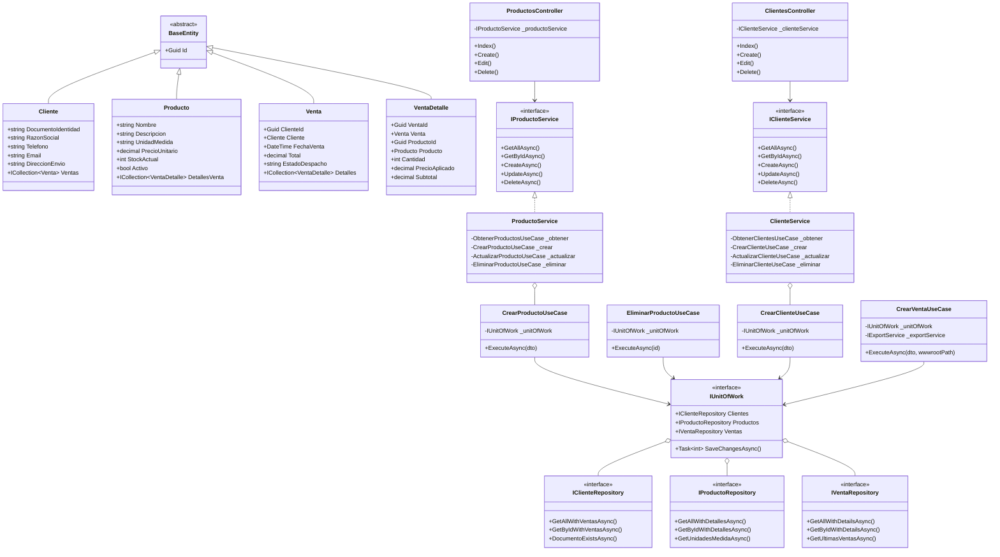

---

### Diagrama Entidad-Relación (ER) Completo

Incluye las tablas del dominio comercial y las tablas de seguridad de **ASP.NET Core Identity**:

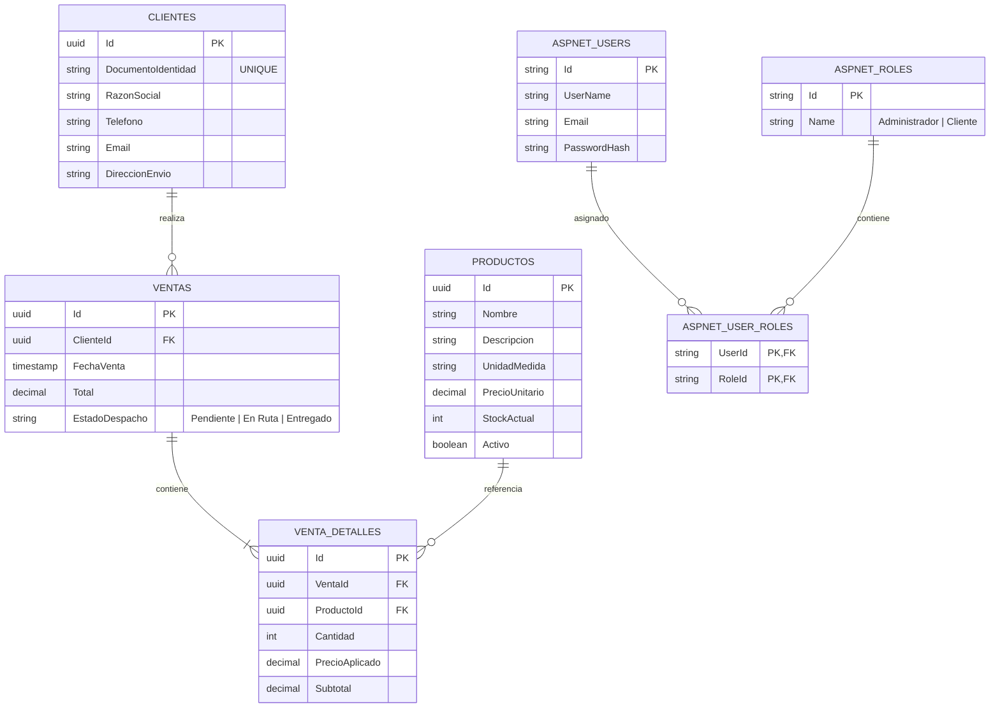

---

### Diagrama de Secuencia (Flujo de Autenticación y Dashboard)

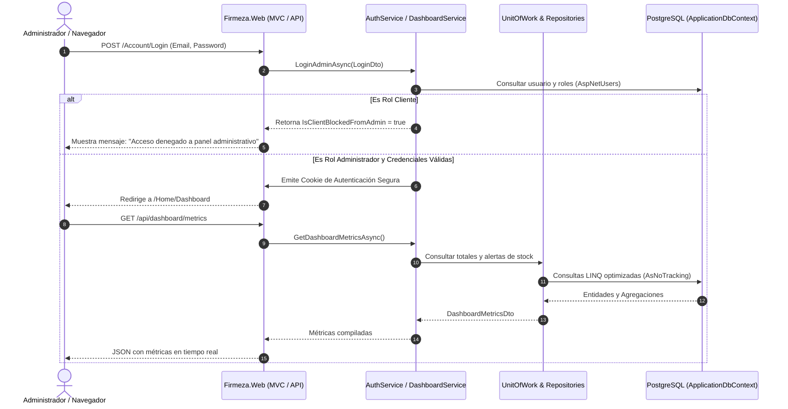

---

## 🗄️ Patrón Repository y Unit of Work (Acceso a Datos Desacoplado)

### 📌 ¿Qué hace la carpeta `Repositories`?
La carpeta **`Repositories`** (ubicada en `Firmeza.Infrastructure/Repositories`) implementa el **Patrón Repositorio**, el cual actúa como mediador entre la persistencia (`ApplicationDbContext` / EF Core) y los servicios de aplicación (`Services`).

### 🎯 Beneficios Arquitectónicos:
1. **Desacoplamiento Absoluto:** Los servicios (`ClienteService`, `ProductoService`) y controladores no tienen referencias a LINQ ni al `DbContext` directamente.
2. **Inversión de Dependencias (DIP):** Los contratos se declaran en `Firmeza.Application/Interfaces/Repositories/` y las implementaciones concretas en `Firmeza.Infrastructure/Repositories/`.
3. **Unidad de Trabajo (Unit of Work):** Coordina múltiples repositorios asegurando que todas las operaciones de inserción, actualización o eliminación se ejecuten en una única transacción atómica con `SaveChangesAsync()`.

| Contrato (`Application`) | Implementación (`Infrastructure`) | Responsabilidad |
| :--- | :--- | :--- |
| `IBaseRepository<T>` | `BaseRepository<T>` | Operaciones CRUD genéricas (`GetByIdAsync`, `GetAllAsync`, `AddAsync`, `UpdateAsync`, `DeleteAsync`, `ExistsAsync`). |
| `IClienteRepository` | `ClienteRepository` | Consultas con historial de ventas, validación de unicidad de NIT y filtros avanzados. |
| `IProductoRepository` | `ProductoRepository` | Catálogo de materiales, unidades de medida y alertas de inventario. |
| `IVentaRepository` | `VentaRepository` | Órdenes históricas con desglose de productos y clientes asociados. |
| `IUnitOfWork` | `UnitOfWork` | Agrupa todos los repositorios y controla el guardado atómico transaccional. |

---

## 📦 Módulo de Gestión de Productos (CRUD, ViewModels y Filtrado)

* **Crear (`Create`):** Registro de nuevos materiales con validación de precios positivos, unidades de medida y stock inicial.
* **Consultar (`Index` y `Details`):** Vista de catálogo con filtros por unidad de medida, estado activo/inactivo, alerta de stock bajo (`< 50`) y ordenamiento multi-criterio.
* **Actualizar (`Edit`):** Modificación de especificaciones y precios de catálogo.
* **Eliminar / Desactivar (`Delete`):** Lógica de **integridad histórica**. Si el producto ya cuenta con ventas asociadas, se realiza un **Soft Delete** (`Activo = false`) para proteger los reportes contables del pasado; si no tiene ventas, se elimina físicamente.

---

## 👥 Módulo de Gestión de Clientes (CRUD, Validaciones, Búsqueda y Notificaciones SMTP)

* **Crear (`Create`):** Registro de constructoras y clientes con validación estricta de formato y unicidad de Documento/NIT.
  - **Disparador Automático de Bienvenida:** Envía automáticamente un correo electrónico en formato HTML responsivo con la bienvenida corporativa al cliente a través de [`IEmailService`](file:///home/cohorte-5/Escritorio/Firmeza/src/Firmeza.Application/Interfaces/IEmailService.cs).
* **Consultar (`Index` y `Details`):** Listado con canales de contacto, dirección de despacho y acumulado histórico de facturación.
* **Actualizar (`Edit`):** Edición de información de contacto validando que no se duplique el NIT con otro cliente.
* **Eliminar (`Delete`):** Protección referencial. Si el cliente tiene ventas registradas (`totalCompras > 0`), el sistema **bloquea la eliminación** para salvaguardar la trazabilidad fiscal.

### 📧 Servicio de Notificaciones por Correo Electrónico (SMTP Gmail & Corporativo)

El sistema implementa un motor desacoplado de notificaciones por correo electrónico diseñado bajo el **Principio de Inversión de Dependencias (DIP)**:

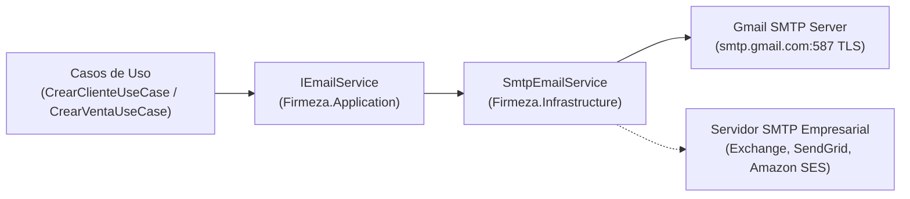

#### 🎯 Características y Flexibilidad Arquitectónica:
1. **Desacoplamiento Total:** La capa de aplicación (`Application`) solo conoce la interfaz `IEmailService`. No depende de librerías SMTP ni de proveedores específicos.
2. **Sustitución en Caliente (Hot-Swappable):** Cambiar de Gmail a un servidor SMTP corporativo (Microsoft 365, AWS SES, SendGrid o relay interno) se logra modificando únicamente la sección `EmailSettings` en `appsettings.json` **sin tocar una sola línea de código**.
3. **Plantillas HTML Profesionales:**
   * **Notificación de Bienvenida / Registro:** Saludo personalizado, resumen de beneficios y botón de acceso a la plataforma.
   * **Confirmación de Compra:** Desglose financiero, estado de despacho y **adjunto automático del comprobante en PDF (`recibo_venta_{id}.pdf`)** generado en tiempo real.
4. **Resiliencia y Modo Simulación (`IsSimulationMode`):** Si las credenciales no están configuradas o el flag de simulación está activo, el servicio registra la salida en el log de auditoría sin interrumpir las transacciones comerciales en base de datos.

#### ⚙️ Configuración en `appsettings.json`:
```json
"EmailSettings": {
  "SmtpServer": "smtp.gmail.com",
  "Port": 587,
  "EnableSsl": true,
  "SenderName": "FIRMEZA - Materiales de Construcción",
  "SenderEmail": "tu_correo@gmail.com",
  "Username": "tu_correo@gmail.com",
  "Password": "tu_app_password_de_gmail",
  "IsSimulationMode": false
}
```

---

---

## 📊 Módulo de Importación y Normalización de Excel con EPPlus

El sistema integra un motor avanzado de procesamiento de archivos **Excel (.xlsx / .xls)** utilizando la librería **EPPlus**, diseñado específicamente para resolver el problema de hojas de cálculo **no normalizadas, con datos desorganizados o columnas mezcladas** provenientes de sistemas externos, exportaciones heterogéneas o planillas manuales de clientes y proveedores.

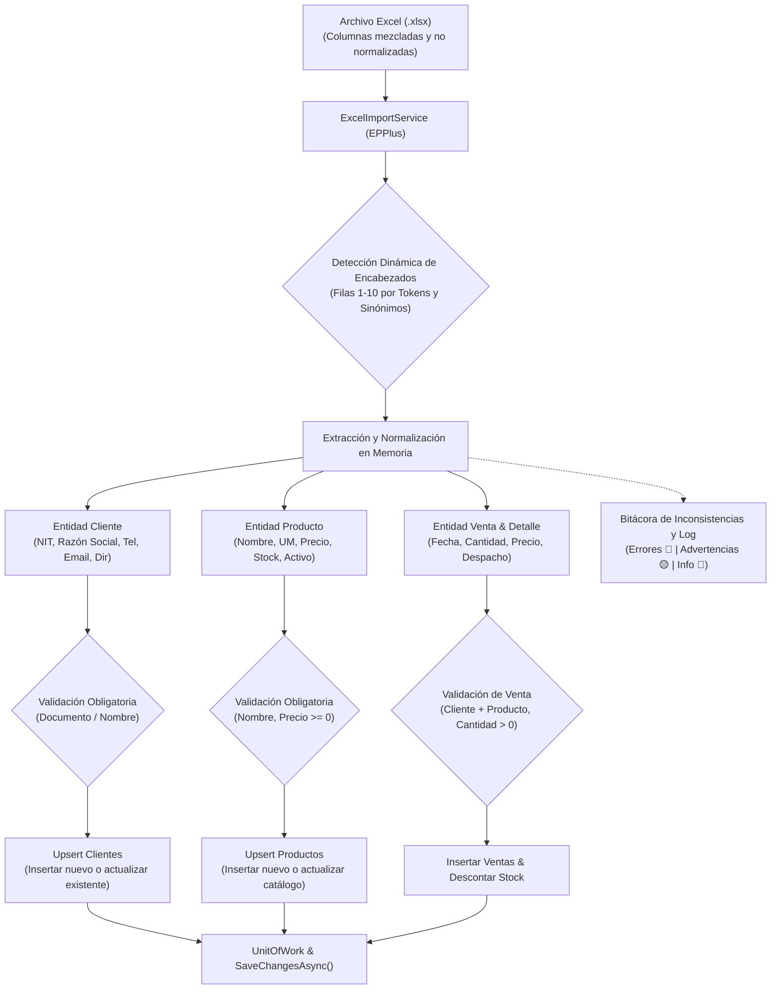

### 🧠 Capacidades y Lógica de Normalización:

1. **Detección Dinámica de Encabezados y Mapeo Flexible:**
   - Examina las primeras 10 filas de cada hoja para identificar la fila real de encabezados, permitiendo archivos que contengan títulos o metadatos superiores.
   - Diccionario semántico tolerante a tildes, mayúsculas, guiones y barras (`/`):
     - **Clientes:** `nit`, `cedula`, `documento`, `id_cliente`, `razon_social`, `nombre_cliente`, `empresa`, `telefono`, `celular`, `direccion_envio`, `email`, `correo`.
     - **Productos:** `producto`, `articulo`, `material`, `item`, `descripcion`, `unidad_medida`, `u.m.`, `precio_unitario`, `stock_actual`, `disponible`, `activo`.
     - **Ventas y Detalles:** `cantidad_vendida`, `cant`, `unidades`, `precio_aplicado`, `precio_venta`, `fecha_venta`, `estado_despacho`, `nro_factura`, `referencia`.

2. **División y Relacionamiento en Memoria:**
   - Si una sola fila contiene datos del cliente (ej. *Constructora Bolívar*), datos del producto (ej. *Cemento Gris Argos 50kg*) y datos de la venta (ej. *150 bultos el 2026-10-01*), el motor los extrae, valida y estructura en memoria vinculando las llaves foráneas (`ClienteId`, `ProductoId`, `VentaId`) de manera automática.
   - Deduplica clientes y productos en memoria para evitar colisiones antes del guardado.

3. **Validación de Datos Obligatorios y Normalización de Formatos:**
   - Limpieza automática de símbolos de moneda (`$`, `€`, `COP`, `USD`), puntos y comas decimales/miles (`1,250.50` vs `1.250,50`).
   - Soporte para fechas en formatos de texto estándar (`dd/MM/yyyy`, `yyyy-MM-dd`) y números de serie serializados de Excel (`OADate`).
   - Exigencia de campos obligatorios:
     - Nombre de producto no vacío y precio no negativo.
     - Documento de identidad o razón social de cliente.
     - Cantidades de venta estrictamente mayores a cero.

4. **Estrategia de Inserción o Actualización (Upsert) y Control de Stock:**
   - **Clientes:** Si ya existe por NIT en la base de datos o en el lote actual, actualiza teléfonos, correos y direcciones; si no, lo registra como nuevo.
   - **Productos:** Si ya existe por nombre de material, actualiza su precio unitario y ajusta el inventario según los parámetros elegidos.
   - **Ventas:** Registra la orden de despacho, congela el precio histórico aplicado y descuenta automáticamente el inventario disponible.

5. **Bitácora Detallada de Inconsistencias y Errores:**
   - Reporte con métricas completas (`ClientesCreados`, `ClientesActualizados`, `ProductosCreados`, `VentasCreadas`, `MontoTotalVentas`).
   - Tabla de bitácora clasificada por severidad:
     - **Error 🔴:** Registros que violan integridad (ej. producto sin nombre, venta sin cliente).
     - **Advertencia 🟡:** Ajustes automáticos aplicados (ej. precio negativo ajustado a $0, email malformado, stock insuficiente).
     - **Info 🔵:** Mapeo de columnas y resumen de ejecución.

6. **Interfaz Web (Razor MVC) y API REST:**
   - **Vista Web (`/Importacion`):** Área de carga con Drag & Drop, interruptores configurables (*Upsert*, *Crear ventas*, *Descontar inventario*), KPIs en tiempo real y tabla interactiva de errores.
   - **Plantilla de Ejemplo:** Botón para descargar un `.xlsx` preconstruido con ejemplos de datos desorganizados y tablas mixtas para pruebas inmediatas.
   - **Endpoint REST:** `POST /api/importacion/excel` (`multipart/form-data`) y `GET /api/importacion/plantilla`.

---

## 📄 Módulo de Exportación de Datos y Comprobantes PDF (QuestPDF & EPPlus)

El sistema cuenta con un motor integral de exportación y generación documental que permite emitir reportes en formatos **Excel (.xlsx)** y **PDF (.pdf)** para todos los módulos clave (**Productos, Clientes y Ventas**), así como la **generación automática de recibos/comprobantes oficiales en PDF** al registrar cada venta en el sistema.

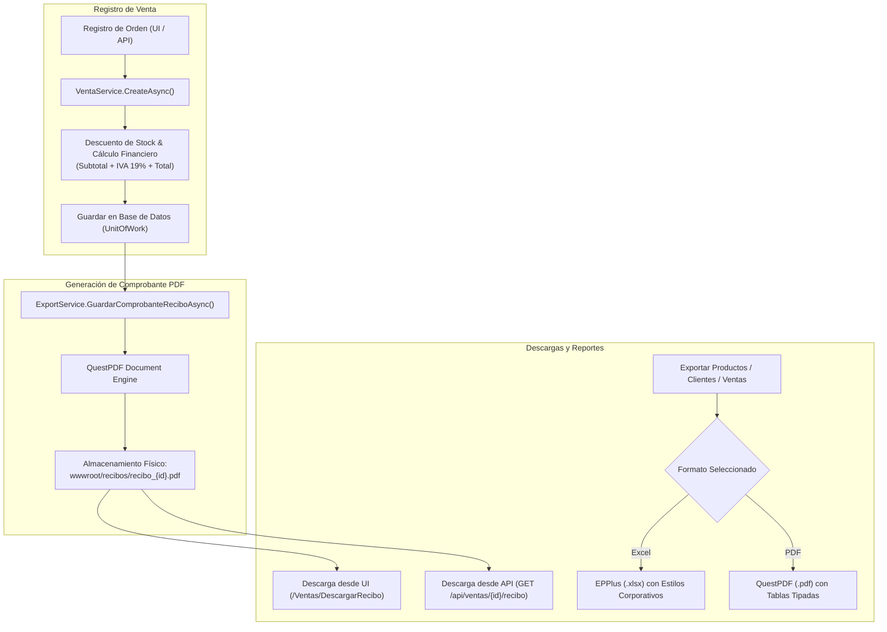

### 🧾 Características de los Comprobantes de Venta en PDF:
1. **Disparador Automático:** Cada vez que se crea una venta (desde la interfaz Razor MVC `/Ventas/Create`, desde el proceso de importación masiva o desde el endpoint REST `POST /api/ventas`), el sistema invoca `IExportService.GuardarComprobanteReciboAsync` generando el documento sin intervención manual.
2. **Estructura Oficial del Recibo:**
   - **Encabezado Corporativo:** Logotipo/Marca "FIRMEZA", NIT empresarial, dirección, teléfono y correo de soporte.
   - **Metadatos de la Orden:** Número oficial consecutivo `#VENTA-{Id}`, fecha y hora exacta de expedición, estado de despacho (`Pendiente`, `En Ruta`, `Entregado`).
   - **Datos Completos del Cliente:** Razón Social / Nombre, Documento de Identidad / NIT, teléfono, correo electrónico y dirección de entrega.
   - **Desglose Detallado de Productos:** Tabla con columnas de Cantidad, Unidad de Medida, Descripción del Material, Precio Unitario y Subtotal por ítem.
   - **Liquidación Financiera e Impuestos:**
     - **Subtotal Base:** Base imponible gravada calculada de forma exacta (`Total / 1.19`).
     - **IVA (19%):** Impuesto al valor agregado discriminado (`Total - SubtotalBase`).
     - **Total General:** Valor total a pagar en Pesos Colombianos (COP).
   - **Pie de Página y Trazabilidad:** Mensaje de validez legal, paginación y fecha de generación del reporte.
3. **Almacenamiento Físico Persistente:**
   - Se guardan en el directorio `wwwroot/recibos/` bajo la convención `recibo_{ventaId}.pdf`.
   - Si la carpeta `wwwroot/recibos` no existe, se crea automáticamente en tiempo de ejecución.
4. **Acceso y Descarga Directa:**
   - Botón directo de **Descargar Recibo (PDF)** en las vistas de listado (`/Ventas`), detalle (`/Ventas/Details/{id}`) y formularios.
   - Endpoint REST: `GET /api/ventas/{id}/recibo` con cabecera `Content-Disposition: inline; filename=recibo_{id}.pdf`.

---

### 📊 Módulo de Exportación General (Excel & PDF):

| Módulo | Formatos Disponibles | Ruta MVC | Endpoint API | Contenido Exportado |
| :--- | :--- | :--- | :--- | :--- |
| **Productos** | Excel (`.xlsx`) & PDF (`.pdf`) | `/Productos/ExportarExcel`<br/>`/Productos/ExportarPdf` | `GET /api/productos/exportar/excel`<br/>`GET /api/productos/exportar/pdf` | ID, Nombre, Descripción, Unidad de Medida, Precio Unitario, Stock Actual y Estado Activo/Inactivo. |
| **Clientes** | Excel (`.xlsx`) & PDF (`.pdf`) | `/Clientes/ExportarExcel`<br/>`/Clientes/ExportarPdf` | `GET /api/clientes/exportar/excel`<br/>`GET /api/clientes/exportar/pdf` | ID, Documento/NIT, Razón Social, Teléfono, Email, Dirección de Envío y Total Compras. |
| **Ventas** | Excel (`.xlsx`) & PDF (`.pdf`) | `/Ventas/ExportarExcel`<br/>`/Ventas/ExportarPdf` | `GET /api/ventas/exportar/excel`<br/>`GET /api/ventas/exportar/pdf` | ID, Fecha, Cliente (NIT y Nombre), Cantidad de Ítems, Total Facturado y Estado de Despacho. |

---

## 🔄 Mapeo de Objetos y DTOs con AutoMapper

Para mantener el desacoplamiento entre las entidades de dominio y los contratos de datos expuestos hacia la Web MVC, APIs REST o la SPA, el sistema utiliza **AutoMapper** configurado en la capa `Firmeza.Application`.

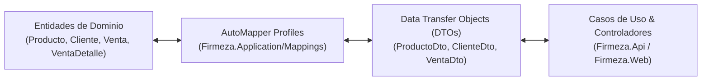

### 🎯 Beneficios del uso de AutoMapper & DTOs:
1. **Encapsulamiento del Dominio:** Evita exponer las entidades de base de datos directamente al exterior, previniendo sobre-exposición de campos internos o modificaciones no autorizadas.
2. **Transformaciones y Agregaciones Automáticas:** Calcula propiedades calculadas automáticamente (por ejemplo, `TotalCompras` y `MontoTotalComprado` a partir de la colección de ventas de un cliente, o nombres descriptivos de productos en los detalles de venta).
3. **Limpieza y Sanitización de Entrada:** Aplica `.Trim()` y `.ToLower()` en cadenas de texto durante la conversión de `CreateDto`/`UpdateDto` hacia la entidad de dominio.
4. **Registro Centralizado en IoC:** Se registra con `services.AddAutoMapper(typeof(DependencyInjection).Assembly)` en `Firmeza.Application/DependencyInjection.cs`, descubriendo automáticamente todos los perfiles de mapeo en el ensamblado.

### 📋 Perfiles de Mapeo Implementados:

| Perfil de AutoMapper | Ubicación | Entidad Origen / Destino | DTOs Mapeados | Transformaciones Clave |
| :--- | :--- | :--- | :--- | :--- |
| **`ProductoMappingProfile`** | `Application/Mappings/` | `Producto` | `ProductoDto`<br/>`CreateProductoDto`<br/>`UpdateProductoDto` | - Asignación automática de nuevo `Guid`.<br/>- Sanitización con `.Trim()` en Nombre, Descripción y Unidad de Medida. |
| **`ClienteMappingProfile`** | `Application/Mappings/` | `Cliente` | `ClienteDto`<br/>`CreateClienteDto`<br/>`UpdateClienteDto` | - Conteo de órdenes: `TotalCompras = Ventas.Count`.<br/>- Suma monetaria: `MontoTotalComprado = Ventas.Sum(Total)`.<br/>- Normalización en minúsculas para el `Email`. |
| **`VentaMappingProfile`** | `Application/Mappings/` | `Venta`<br/>`VentaDetalle` | `VentaDto`<br/>`VentaDetalleDto`<br/>`CreateVentaDto` | - Resolución de `ClienteRazonSocial` y `ClienteDocumento`.<br/>- Resolución de `ProductoNombre` y `UnidadMedida` en detalles.<br/>- Estado de despacho por defecto `Pendiente` y timestamp `UtcNow`. |

---

## 🛡️ Manejo de Errores con Try-Catch y Validaciones de Entrada

La capa de aplicación implementa manejo defensivo de excepciones mediante [`ValidadorEdad`](file:///home/cohorte-5/Escritorio/Firmeza/src/Firmeza.Application/Validators/ValidadorEdad.cs), aplicando bloques `try-catch` con captura de excepciones tipadas:
1. **`FormatException`:** Captura texto no numérico ingresado en campos enteros.
2. **`OverflowException`:** Captura valores fuera del rango permitido de un entero de 32 bits.
3. **`Exception` General:** Captura errores inesperados, retornando siempre mensajes claros y amigables al usuario que se reflejan en el `ModelState` y en las vistas Razor.

---

## 🔐 Seguridad y Control de Acceso (RBAC & JWT)

El sistema implementa una arquitectura híbrida y robusta de autenticación y autorización basada en roles (RBAC) y tokens criptográficos:

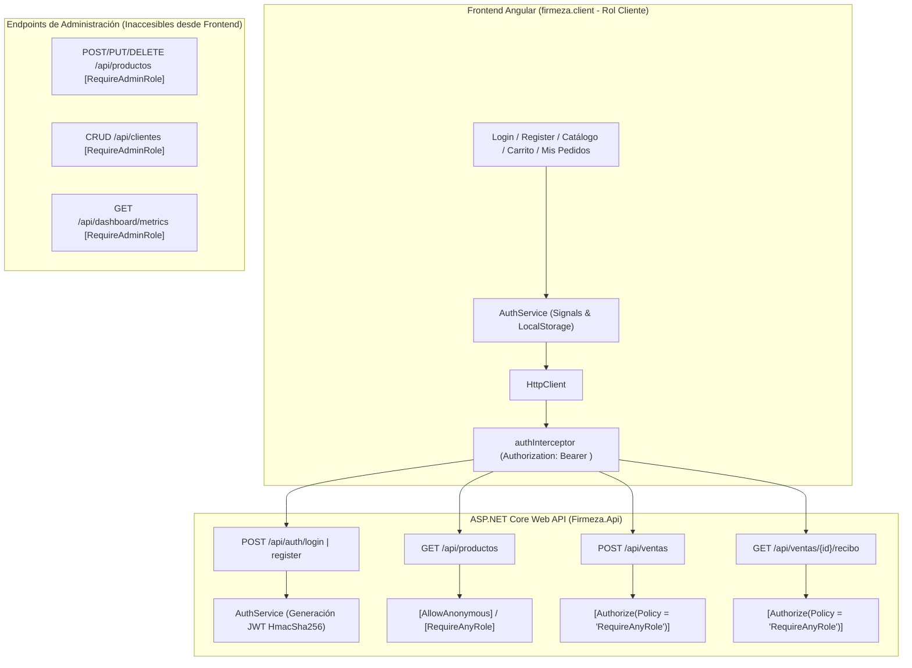

### 1. Modelos de Autenticación Soportados:
* **Tokens JWT Bearer (ASP.NET Core Web API):** Utilizado por el portal Angular (`firmeza.client`) y aplicaciones cliente externas. Los tokens se firman mediante el algoritmo `HmacSha256` e integran claims de identidad (`NameIdentifier`, `Email`, `Role`, `Jti`) con un tiempo de expiración configurable (7 días).
* **Cookies de Sesión Seguras (Razor MVC):** Utilizado por el panel administrativo interno en `Firmeza.Web` con expiración deslizante, protección contra CSRF (`ValidateAntiForgeryToken`) y redirección a `/Account/Login`.

### 2. Flujo de Autenticación JWT en Frontend Angular:
1. **Inicio de Sesión y Registro (`AuthService`):**
   - El usuario envía credenciales a `POST /api/auth/login` o completa el formulario de registro en `POST /api/auth/register` (asignando automáticamente el rol `Cliente`).
   - Al responder la API con éxito, el token JWT y los datos de sesión se almacenan en `LocalStorage` (`firmeza_jwt_token` y `firmeza_user_session`).
   - El estado de autenticación se gestiona reactivamente mediante **Angular Signals** (`currentUser`, `isAuthenticated`, `isCliente`).
2. **Inyección Automática de Cabeceras (`authInterceptor`):**
   - Interceptor funcional de Angular (`HttpInterceptorFn`) que clona las solicitudes HTTP e inyecta la cabecera:
     ```http
     Authorization: Bearer <token_jwt>
     ```
3. **Manejo de Expiración y Redirección:**
   - Si el servidor retorna un error `401 Unauthorized` o el método `isTokenExpired()` detecta que el timestamp de expiración del token fue superado, el interceptor limpia el almacenamiento local y redirige inmediatamente al usuario a `/login` con el mensaje de sesión expirada.
4. **Guardias de Navegación (`authGuard` y `guestGuard`):**
   - `authGuard`: Protege las rutas privadas del portal (`/productos`, `/carrito`, `/mis-pedidos`), verificando la validez del token antes de permitir la activación de la ruta.
   - `guestGuard`: Evita que un cliente ya autenticado acceda innecesariamente a `/login` o `/register`, redirigiéndolo al catálogo.

### 3. Segregación Estricta de Roles (RBAC) y Aislamiento de Endpoints:
* **Rol `Cliente` (Frontend SPA):**
  - **Endpoints Habilitados:** Registro (`POST /api/auth/register`), Autenticación (`POST /api/auth/login`, `GET /api/auth/me`, `POST /api/auth/logout`), Consulta de catálogo de productos (`GET /api/productos`), Creación de órdenes de venta (`POST /api/ventas`), Consulta de orden (`GET /api/ventas/{id}`) y Descarga de comprobantes oficiales en PDF (`GET /api/ventas/{id}/recibo`).
  - **Endpoints Administrativos Bloqueados:** Las operaciones de creación/edición/eliminación de inventario (`POST/PUT/DELETE /api/productos`), gestión de clientes (`/api/clientes`) y métricas globales (`/api/dashboard/metrics`) están protegidas con la política `RequireAdminRole` y no son accesibles desde el frontend.
* **Rol `Administrador` (Panel Razor MVC):**
  - Acceso total a la administración de usuarios, importación masiva en Excel, métricas financieras del dashboard y mantenimiento de catálogo.

---

## 🎨 Diseño Visual, UI/UX y Frontend (Razor MVC & Angular 22 SPA)

Tanto en **ASP.NET Core Razor MVC** como en el **Portal Angular SPA (`firmeza.client`)**, la experiencia de usuario mantiene un diseño profesional, reactivo y moderno:

### 1. Arquitectura del Frontend Angular (`firmeza.client`):
* **Componentes Standalone:** Arquitectura modular en Angular 22 basada en componentes independientes:
  - **`LoginComponent` (`/login`):** Formulario de autenticación con visualización de contraseña, botón de carga rápida de credenciales demo (`cliente@firmeza.com`) y feedback de errores.
  - **`RegisterComponent` (`/register`):** Registro de nuevos clientes con validación de edad mínima (18 años), confirmación de contraseña y asignación del rol `Cliente`.
  - **`CatalogoComponent` (`/productos`):** Catálogo de materiales con stock en tiempo real, precios unitarios en COP, selector de cantidad y botón para añadir al carrito.
  - **`CarritoComponent` (`/carrito`):** Resumen de pedido con cálculo dinámico de Subtotal, IVA discriminado (19%), confirmación de orden (`POST /api/ventas`) y botón de **Descarga Inmediata de Comprobante PDF**.
  - **`MisPedidosComponent` (`/mis-pedidos`):** Historial de compras con estado de despacho (`Pendiente`, `En Ruta`, `Entregado`) y botón para descargar el recibo oficial en PDF.
  - **`HeaderComponent` & `FooterComponent`:** Barra de navegación superior con badge reactivo del carrito, información del cliente autenticado y botón de cierre de sesión.
* **Gestión de Estado Reactivo (`CartService`):** Manejo del carrito de compras en memoria y persistencia local (`firmeza_cart_items`) mediante Signals calculadas (`totalCount`, `totalAmount`, `subtotalBase`, `ivaAmount`).
* **Cliente HTTP y Proxy de Desarrollo (`proxy.conf.json`):**
  - En desarrollo independiente (`http://localhost:4200`), las llamadas a `/api/*` se canalizan mediante proxy hacia la API REST (`http://localhost:5100`).
  - En producción, el comando `npm run build` compila el paquete distribuible directamente hacia `src/Firmeza.Web/wwwroot/spa`.

### 2. Elementos Visuales y UI:
1. **Encabezado Superior (Header):** Identidad del sistema, estado en tiempo real de la sesión, badge de ítems en carrito, avatar del usuario y acción de logout.
2. **Pie de Página (Footer):** Barra de cierre con información de seguridad JWT y versión del sistema.
3. **Paleta de Colores y Tipografía:**
   * Primario: `#2563eb` (Royal Blue)
   * Éxito: `#10b981` (Emerald)
   * Superficies Oscuras: `#0f172a` y `#111827`
   * Fondo de Contenido: `#f8fafc` (Slate 50)
   * Tipografía: `system-ui`, `-apple-system`, `Roboto`, `Helvetica Neue`.

---

## 🧪 Pruebas Unitarias Automatizadas (xUnit & Moq)

El proyecto cuenta con una suite de **67 pruebas unitarias automatizadas** en [`tests/Firmeza.UnitTests/`](file:///home/cohorte-5/Escritorio/Firmeza/tests/Firmeza.UnitTests) utilizando **xUnit** (framework de pruebas oficial y líder en el ecosistema .NET) y **Moq** (librería de aislamiento y dobles de prueba/mocking).

### 🎯 ¿Qué es xUnit y por qué se utiliza?
* **xUnit.net** es un framework de pruebas moderno, extensible y orientado a la programación orientada a objetos para C# y .NET.
* Permite validar de forma rápida y reproducible que las reglas de negocio y los componentes del sistema funcionen con exactitud sin necesidad de levantar un servidor web ni conectar una base de datos real.

### 📐 Estructura de las Pruebas: Patrón AAA (Arrange - Act - Assert)
Cada método de prueba sigue el estándar internacional **AAA**:
1. **Arrange (Organizar / Preparar):** Inicializa variables, entidades y configura los mocks de dependencias.
2. **Act (Actuar / Ejecutar):** Invoca el método, validador o servicio bajo prueba.
3. **Assert (Afirmar / Verificar):** Comprueba mediante aserciones (`Assert.Equal`, `Assert.True`, `Assert.ThrowsAsync`, etc.) que el resultado coincida exactamente con lo esperado.

### 🧩 Tipos de Pruebas en xUnit:
* **`[Fact]`:** Pruebas con condiciones e invariantes fijas que siempre deben cumplirse.
* **`[Theory]`:** Pruebas parametrizadas ejecutadas con múltiples conjuntos de datos (`[InlineData(...)]`) para verificar casos límite, datos válidos y datos erróneos en una sola prueba.

### 📦 Batería de Pruebas Implementadas (67 Pruebas):

| Proyecto / Capa | Archivo de Prueba | Escenarios Validados |
| :--- | :--- | :--- |
| **Dominio (`Domain`)** | [`ProductoEntityTests.cs`](file:///home/cohorte-5/Escritorio/Firmeza/tests/Firmeza.UnitTests/Domain/ProductoEntityTests.cs) | Inicialización correcta de propiedades de producto y evaluación del umbral de alerta de bajo stock (`Stock < 50`). |
| **Dominio (`Domain`)** | [`VentaDetalleEntityTests.cs`](file:///home/cohorte-5/Escritorio/Firmeza/tests/Firmeza.UnitTests/Domain/VentaDetalleEntityTests.cs) | Cálculo de subtotal histórico multiplicando `Cantidad * PrecioAplicado` congelado al momento de la venta. |
| **Aplicación (`Application`)** | [`ValidadorEdadTests.cs`](file:///home/cohorte-5/Escritorio/Firmeza/tests/Firmeza.UnitTests/Application/ValidadorEdadTests.cs) | Validación con `try-catch`, captura de `FormatException` (texto alfabético), `OverflowException` (números que exceden Int32) y rangos laborales. |
| **Aplicación (`Application`)** | [`AutoMapperProfilesTests.cs`](file:///home/cohorte-5/Escritorio/Firmeza/tests/Firmeza.UnitTests/Application/AutoMapperProfilesTests.cs) | Validez integral de configuración de AutoMapper y mapeos bidireccionales de Productos, Clientes y Ventas/Detalles con agregaciones calculadas. |
| **Casos de Uso (`Application`)** | [`ProductosUseCasesTests.cs`](file:///home/cohorte-5/Escritorio/Firmeza/tests/Firmeza.UnitTests/UseCases/ProductosUseCasesTests.cs) | Ejecución aislada de `CrearProductoUseCase` y `EliminarProductoUseCase` con regla de soft delete. |
| **Casos de Uso (`Application`)** | [`ClientesUseCasesTests.cs`](file:///home/cohorte-5/Escritorio/Firmeza/tests/Firmeza.UnitTests/UseCases/ClientesUseCasesTests.cs) | Ejecución de `CrearClienteUseCase` y validación de restricción de borrado en `EliminarClienteUseCase`. |
| **Casos de Uso (`Application`)** | [`VentasUseCasesTests.cs`](file:///home/cohorte-5/Escritorio/Firmeza/tests/Firmeza.UnitTests/UseCases/VentasUseCasesTests.cs) | Actualización de trazabilidad de entrega en `ActualizarEstadoDespachoUseCase`. |
| **Servicios (`Application`)** | [`ClienteServiceTests.cs`](file:///home/cohorte-5/Escritorio/Firmeza/tests/Firmeza.UnitTests/Services/ClienteServiceTests.cs) | Aislamiento con `Mock<IUnitOfWork>`. Verifica que `DeleteAsync` arroje `InvalidOperationException` si el cliente tiene compras, y borre limpiamente si no las tiene. |
| **Servicios (`Application`)** | [`ProductoServiceTests.cs`](file:///home/cohorte-5/Escritorio/Firmeza/tests/Firmeza.UnitTests/Services/ProductoServiceTests.cs) | Aislamiento con `Mock<IUnitOfWork>`. Valida que al eliminar un producto con ventas asociadas se aplique **Soft Delete** (`Activo = false`), y que `CreateAsync` registre y confirme cambios. |
| **Servicios (`Application`)** | [`VentaServiceTests.cs`](file:///home/cohorte-5/Escritorio/Firmeza/tests/Firmeza.UnitTests/Services/VentaServiceTests.cs) | Creación de ventas, cálculo financiero (Subtotal, IVA 19%, Total), descuento automático de existencias en inventario, validaciones de stock insuficiente y almacenamiento físico de comprobantes PDF. |
| **Servicios (`Infrastructure`)** | [`ExportServiceTests.cs`](file:///home/cohorte-5/Escritorio/Firmeza/tests/Firmeza.UnitTests/Services/ExportServiceTests.cs) | Exportación a Excel (EPPlus) y PDF (QuestPDF) para productos, clientes y ventas, generación de bytes de recibo PDF y guardado físico en disco en `wwwroot/recibos/`. |
| **Servicios (`Infrastructure`)** | [`ExcelImportServiceTests.cs`](file:///home/cohorte-5/Escritorio/Firmeza/tests/Firmeza.UnitTests/Services/ExcelImportServiceTests.cs) | Validación con EPPlus: normalización en memoria de columnas mixtas, deduplicación y vinculación de ventas/detalles, upsert de clientes y productos, detección de encabezados desplazados y log de inconsistencias. |
| **Servicios (`Infrastructure`)** | [`EmailServiceTests.cs`](file:///home/cohorte-5/Escritorio/Firmeza/tests/Firmeza.UnitTests/Services/EmailServiceTests.cs) | Notificaciones SMTP, modo simulación, validación defensiva de emails, generación de plantillas HTML de bienvenida y confirmación de órdenes con recibo PDF adjunto. |
| **Controladores (`Web`)** | [`VentasControllerTests.cs`](file:///home/cohorte-5/Escritorio/Firmeza/tests/Firmeza.UnitTests/Controllers/VentasControllerTests.cs) | Flujos MVC de `Index` con métricas, `Details`, `Create` GET/POST, exportaciones Excel/PDF y descarga de recibos con aislamiento de servicios. |
| **Controladores (`Web`)** | [`ImportacionControllerTests.cs`](file:///home/cohorte-5/Escritorio/Firmeza/tests/Firmeza.UnitTests/Controllers/ImportacionControllerTests.cs) | Validación de archivos subidos, soporte `.xlsx`/`.xls`, procesamiento con opciones de importación y descarga de plantilla. |
| **Controladores REST (`Api`)** | [`ApiControllersTests.cs`](file:///home/cohorte-5/Escritorio/Firmeza/tests/Firmeza.UnitTests/Controllers/ApiControllersTests.cs) | Operaciones CRUD RESTful (`GET`, `POST`, `PUT`, `DELETE`), códigos HTTP (`200 OK`, `201 CreatedAtAction`, `204 NoContent`), respuestas basadas en DTOs y validación de esquemas. |

### ⚡ Comando para Ejecutar las Pruebas:
```bash
dotnet test
```
> Ejecuta todas las pruebas unitarias y genera el reporte de éxito en la terminal.

---

## 🚀 Guía de Puesta en Marcha (Instalación y Ejecución Local)

### Requisitos Previos:
- **.NET SDK 10.0** (o versión superior compatible).
- **Node.js (v18+)** y **npm**.
- **PostgreSQL (v14+)** en ejecución.

### 1. Configurar la Conexión a Base de Datos
Edita `src/Firmeza.Web/appsettings.json` y `src/Firmeza.Api/appsettings.json`:
```json
"ConnectionStrings": {
  "DefaultConnection": "Host=localhost;Port=5432;Database=firmeza_db;Username=postgres;Password=tu_password"
}
```

### 2. Ejecutar el Servidor Web (Razor MVC / Panel Administrativo)
```bash
dotnet run --project src/Firmeza.Web/Firmeza.Web.csproj
```
> **URL:** `http://localhost:5281` (o `https://localhost:7091`)  
> **Nota:** Al iniciar, [`Program.cs`](file:///home/cohorte-5/Escritorio/Firmeza/src/Firmeza.Web/Program.cs) ejecuta automáticamente las migraciones y sembrado si la base de datos es nueva.

### 3. Ejecutar el Servidor REST API (`Firmeza.Api`)
```bash
dotnet run --project src/Firmeza.Api/Firmeza.Api.csproj
```
> **URL Base:** `http://localhost:5100` (o `https://localhost:7100`)  
> **Swagger UI (Documentación Interactiva & JWT):** `http://localhost:5100/swagger`

### 4. Ejecutar el Frontend Angular SPA de Forma Independiente
```bash
cd firmeza.client
npm install
npm start
```
> **URL SPA:** `http://localhost:4200`  
> *(Las peticiones `/api/*` se redirigen automáticamente a la API REST mediante `proxy.conf.json`).*

---

## 🐳 Despliegue y Ejecución con Docker y Docker Compose

El proyecto incluye soporte integral de contenedorización con orquestación mediante **`docker-compose.yml`**, implementando un orden de inicio estricto donde **las pruebas unitarias son el primer paso obligatorio**:

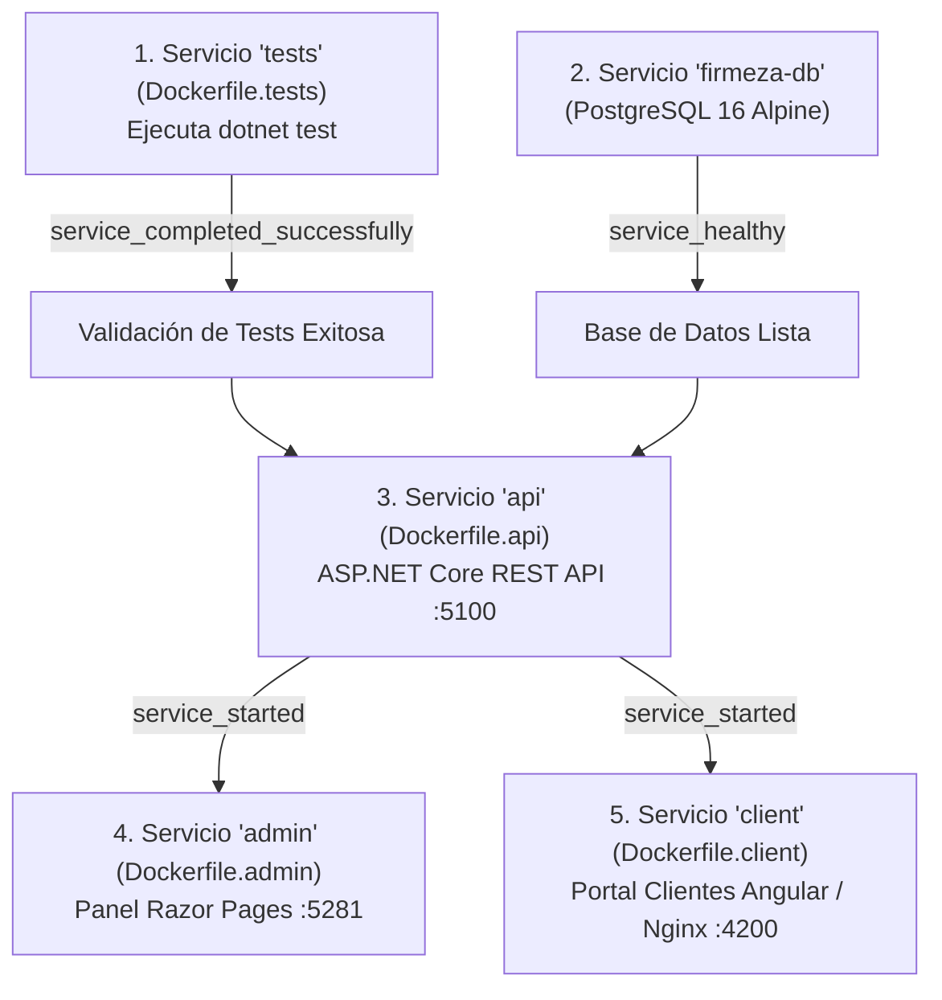

### 1. Servicios Definidos en `docker-compose.yml`:
1. **`tests` (Paso Obligatorio Inicial):**
   - Construido con [`Dockerfile.tests`](file:///home/cohorte-5/Escritorio/Firmeza/Dockerfile.tests).
   - Ejecuta `dotnet test` sobre la batería completa de pruebas unitarias. Si alguna prueba falla, el proceso finaliza con código de error ($\ne 0$) y detiene el levantamiento de los demás contenedores.
2. **`firmeza-db` (Base de Datos):**
   - Imagen oficial `postgres:16-alpine` con volumen persistente (`postgres_data`), credenciales seguras y healthcheck mediante `pg_isready`.
3. **`api` (Firmeza.API):**
   - Construido con [`Dockerfile.api`](file:///home/cohorte-5/Escritorio/Firmeza/Dockerfile.api).
   - Expone la API REST en el puerto `5100` (`http://localhost:5100/swagger`).
   - Depende de: `tests` (`service_completed_successfully`) y `firmeza-db` (`service_healthy`).
4. **`admin` (Firmeza.Admin - Panel Razor Pages):**
   - Construido con [`Dockerfile.admin`](file:///home/cohorte-5/Escritorio/Firmeza/Dockerfile.admin).
   - Expone el panel administrativo en el puerto `5281` (`http://localhost:5281`).
   - Depende de: `tests`, `firmeza-db` y `api`.
5. **`client` (Firmeza.Client - Portal Angular SPA):**
   - Construido con [`Dockerfile.client`](file:///home/cohorte-5/Escritorio/Firmeza/Dockerfile.client).
   - Servido mediante Nginx Alpine de alto rendimiento en el puerto `4200` (`http://localhost:4200`).
   - Depende de: `tests` y `api`.

### 2. Comandos de Ejecución:

```bash
# 1. Construir imágenes y ejecutar todo el ecosistema (ejecutando tests primero de forma obligatoria)
docker compose up --build

# 2. Ejecutar únicamente la suite de pruebas automatizadas en contenedor
docker compose run --rm tests

# 3. Ver los logs en tiempo real de todos los servicios
docker compose logs -f

# 4. Detener y limpiar contenedores, volúmenes y redes
docker compose down
```

Una vez levantado todo el ecosistema con `docker compose up --build`, accede desde tu navegador a:
* **Portal Cliente (Angular SPA):** `http://localhost:4200`
* **Panel Web Administrativo (Razor Pages):** `http://localhost:5281`
* **API REST & Swagger UI:** `http://localhost:5100/swagger`
* **Base de Datos PostgreSQL:** Puerto `5432` (`localhost:5432`)

---

## 👥 Cuentas y Datos Semilla por Defecto (Seeders)

### Usuarios de Prueba Preconfigurados:
| Rol | Correo Electrónico | Contraseña | Comportamiento en `/Account/Login` |
| :--- | :--- | :--- | :--- |
| **Administrador** | `admin@firmeza.com` | `Admin123*` | Inicia sesión exitosamente y accede al Dashboard |
| **Cliente** | `cliente@firmeza.com` | `Cliente123*` | Se rechaza con advertencia de bloqueo administrativo |

### Materiales Sembrados en Base de Datos:
* **Cemento Gris Tipo 1 x 50kg** (Bolsa - $32,000 COP)
* **Varilla Corrugada 1/2"** (Unidad - $45,000 COP)
* **Ladrillo Estructurado Arcilla 10x20x40** (Millar - $1,200,000 COP)
* **Arena Lavada de Río (M3)** (M3 - $85,000 COP)

---

## 🧭 Guía Paso a Paso para Pruebas de Extremo a Extremo (Validación E2E para Evaluadores y TL)

Esta guía describe el procedimiento secuencial para verificar **cada uno de los criterios de aceptación y funcionalidades del sistema** sin necesidad de abrir ningún IDE ni ejecutar comandos complejos:

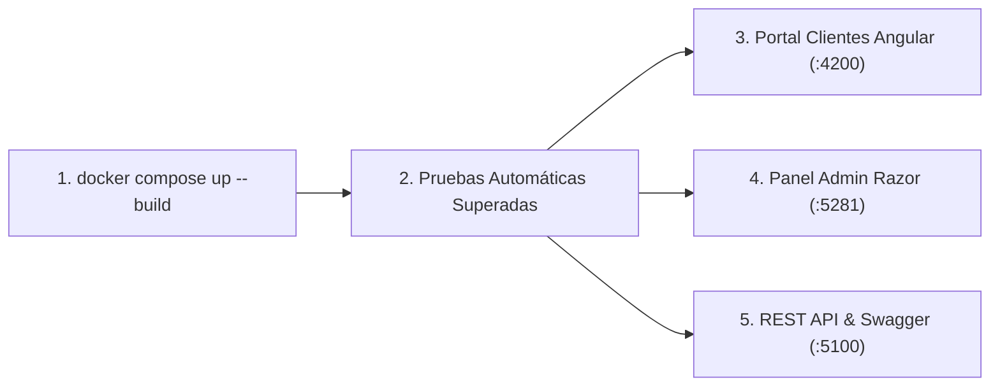

---

### 🔹 Paso 1: Despliegue con Comando Único

Abre una terminal en la raíz del proyecto y ejecuta:

```bash
docker compose up --build
```

**¿Qué validará automáticamente el sistema?**
1. Construirá la imagen `Dockerfile.tests` y ejecutará `dotnet test`.
2. Si las pruebas pasan (67/67 tests exitosos), la compuerta `service_completed_successfully` se satisface y arranca el contenedor de base de datos PostgreSQL (`firmeza-db`).
3. Una vez saludable (`service_healthy`), se inician en paralelo la **API REST** (`api`), el **Panel Admin** (`admin`) y el **Portal Cliente** (`client`).

---

### 🔹 Paso 2: Flujo Completo del Cliente (Portal Angular SPA)

Abre tu navegador en: 👉 **`http://localhost:4200`**

1. **Registro de Nuevo Cliente:**
   * Haz clic en **"¿No tienes cuenta? Regístrate aquí"** (o accede a `http://localhost:4200/#/register`).
   * Diligencia el formulario: Documento / NIT, Razón Social o Nombre, Teléfono, Correo electrónico, Dirección de despacho, Edad (mínimo 18 años) y Contraseña.
   * Al registrarte, el sistema:
     - Guarda el usuario con rol `Cliente` en base de datos.
     - Dispara automáticamente el **correo de bienvenida en HTML** a través del servicio SMTP.
     - Redirige al inicio de sesión con notificación de éxito.
2. **Inicio de Sesión con JWT:**
   * Ingresa las credenciales del nuevo usuario (o usa el botón **"Rellenar Cliente Demo"** para cargar `cliente@firmeza.com` / `Cliente123*`).
   * Haz clic en **"Iniciar Sesión"**. El sistema generará el token JWT, lo almacenará en `LocalStorage` y activará los Signals reactivos de sesión.
   * Serás redirigido inmediatamente al Catálogo de Materiales (`/#/productos`).
3. **Exploración de Catálogo y Carrito:**
   * Observa el catálogo con precios en COP, unidades de medida y stock en tiempo real.
   * Selecciona la cantidad deseada para uno o varios materiales y pulsa **"Añadir"**.
   * Observa cómo el **badge del carrito en la barra superior** se actualiza en tiempo real.
4. **Liquidación Financiera y Confirmación de Compra:**
   * Haz clic en el icono del **Carrito** (o navega a `/#/carrito`).
   * Revisa la tabla del pedido:
     - Modifica cantidades con los botones `+` / `-` o elimina ítems.
     - Verifica el cálculo automático y discriminado: **Subtotal Base**, **IVA (19%)** y **Total a Pagar**.
   * Haz clic en **"Confirmar y Realizar Pedido"**.
   * **El sistema ejecutará automáticamente:**
     - Creación de la orden en base de datos (`POST /api/ventas`).
     - Descuento inmediato de existencias en el inventario.
     - Generación del documento oficial en PDF con QuestPDF.
     - Envío del correo electrónico de confirmación con el **PDF adjunto** vía SMTP.
     - Visualización del banner de éxito con el botón **"Descargar Recibo Oficial (PDF)"**.
5. **Historial de Órdenes y Descarga de Recibos:**
   * Haz clic en **"Mis Pedidos"** en la barra superior (o accede a `/#/mis-pedidos`).
   * Verás el listado de tus órdenes con su consecutivo (`#VENTA-{id}`), fecha, estado de entrega (`Pendiente`, `En Ruta`, `Entregado`) y valor total.
   * Haz clic en el botón **"Descargar Recibo (PDF)"** para obtener el comprobante fiscal generado.
6. **Cierre de Sesión:**
   * Haz clic en el botón **"Cerrar Sesión"** en la esquina superior derecha. El token JWT y el carrito se limpiarán de la memoria y serás redirigido a `/login`.

---

### 🔹 Paso 3: Flujo Administrativo Completo (ASP.NET Core Razor MVC)

Abre tu navegador en: 👉 **`http://localhost:5281`**

1. **Inicio de Sesión Administrativo:**
   * Inicia sesión con las credenciales maestras:
     - **Email:** `admin@firmeza.com`
     - **Contraseña:** `Admin123*`
2. **Dashboard Operativo en Tiempo Real (`/`):**
   * Visualiza las tarjetas de KPIs: Facturación total acumulada, total de clientes registrados, inventario global y alertas de stock bajo (`< 50` unidades).
   * Monitorea el desglose de órdenes por estado de despacho y la lista de las últimas ventas.
3. **Gestión de Materiales y Productos (`/Productos`):**
   * **Crear Material:** Pulsa "Nuevo Producto", ingresa nombre, descripción, unidad de medida, precio y existencias.
   * **Filtros y Búsqueda:** Filtra por unidad de medida o materiales con stock bajo.
   * **Regla de Integridad (Soft Delete):** Intenta eliminar un producto que ya tenga ventas registradas. El sistema aplicará automáticamente **Soft Delete** (`Activo = false`) preservando los registros contables históricos.
   * **Exportación:** Descarga el catálogo en **Excel (.xlsx)** o **PDF (.pdf)** con un solo clic.
4. **Gestión de Clientes (`/Clientes`):**
   * Consulta el directorio de constructoras y clientes con su acumulado total de compras.
   * **Protección Fiscal:** Si intentas eliminar un cliente con historial de compras (`totalCompras > 0`), el sistema **bloqueará la eliminación** para garantizar la trazabilidad legal.
   * Exporta el directorio a Excel o PDF.
5. **Módulo de Importación y Normalización Masiva de Excel (`/Importacion`):**
   * Descarga la **Plantilla de Ejemplo** con columnas heterogéneas y tablas combinadas.
   * Sube el archivo Excel en la zona Drag & Drop con las opciones deseadas (*Upsert*, *Registrar ventas*, *Descontar inventario*).
   * Pulsa **"Procesar y Normalizar Archivo"** y observa el resumen de entidades creadas/actualizadas junto con la bitácora clasificada por severidad (Errores 🔴, Advertencias 🟡, Info 🔵).

---

### 🔹 Paso 4: Exploración de API REST & Documentación Swagger

Abre tu navegador en: 👉 **`http://localhost:5100/swagger`**

1. Revisa todos los endpoints documentados organizados por módulos: `Auth`, `Productos`, `Clientes`, `Ventas`, `Dashboard` e `Importacion`.
2. Pulsa en el botón verde **"Authorize"** en la parte superior derecha e ingresa tu token JWT generado (`Bearer <tu_token>`) para probar endpoints protegidos interactivamente.
3. Comprueba que las operaciones de modificación administrativa (`POST/PUT/DELETE /api/productos`) rechazan accesos con rol `Cliente` y requieren token con rol `Administrador`.

---

### 🔹 Paso 5: Ejecución Manual de Pruebas Unitarias

Si deseas ejecutar las suites de pruebas de forma individual:

```bash
# 1. Pruebas Backend (.NET 10 - xUnit & Moq - 67 pruebas)
dotnet test

# 2. Pruebas Frontend (Angular 22 - Vitest - 3 pruebas)
cd firmeza.client && npx vitest run

# 3. Pruebas en Contenedor Docker Aislado
docker compose run --rm tests
```

---

## 🎓 Banco de Preguntas Clave para Sustentación y Estudio

1. **¿Qué patrón arquitectónico se utilizó y por qué?**
   * *Respuesta:* Clean Architecture en 4 capas (Domain, Application, Infrastructure, Presentation). Garantiza que el núcleo del negocio sea independiente de frameworks, bases de datos e interfaces de usuario.
2. **¿Qué rol cumplen la carpeta `Repositories` y `Unit of Work`?**
   * *Respuesta:* Desacoplan los servicios de Entity Framework Core. Las interfaces están en `Application` (Inversión de Dependencias) y las implementaciones en `Infrastructure/Repositories`. `Unit of Work` agrupa las operaciones asegurando confirmación atómica con `SaveChangesAsync()`.
3. **¿Cómo se protegen los registros históricos al eliminar productos o clientes?**
   * *Respuesta:* Para productos con ventas previas se aplica **Soft Delete** (`Activo = false`). Para clientes con facturas registradas, el sistema restringe el borrado físico para preservar la trazabilidad fiscal.
4. **¿Por qué `VentaDetalle` almacena `PrecioAplicado`?**
   * *Respuesta:* Para congelar el precio unitario del momento de la compra; si el precio de catálogo cambia a futuro, los balances históricos no se alteran.
5. **¿Cómo maneja el sistema la segregación de roles (RBAC)?**
   * *Respuesta:* Mediante ASP.NET Core Identity y el filtro `[Authorize(Roles = Roles.Administrador)]`. `AuthService` bloquea explícitamente el acceso de cuentas con rol `Cliente` al panel administrativo.
6. **¿Cómo se realiza el despliegue en Docker?**
   * *Respuesta:* Con un `Dockerfile` multi-stage que compila la SPA de Angular (Node.js) y la inyecta en el `wwwroot` de la aplicación .NET 10. `docker-compose.yml` orquesta la base de datos PostgreSQL con healthcheck y conecta el contenedor web en una red privada.
7. **¿Cómo se aplican las pruebas unitarias con xUnit y Moq en el proyecto?**
   * *Respuesta:* Mediante el proyecto `tests/Firmeza.UnitTests`, aplicando el patrón AAA (Arrange, Act, Assert). Se prueban entidades del dominio (cálculo de subtotales, reglas de stock), validadores de aplicación (`ValidadorEdad` con captura de excepciones) y servicios de infraestructura (`ClienteService`, `ProductoService`, `VentaService`, `ExportService`, `ExcelImportService`) aislando la base de datos con `Mock<IUnitOfWork>` y base en memoria.
8. **¿Cómo funciona el motor de importación y normalización automática de Excel con EPPlus?**
   * *Respuesta:* Utiliza `ExcelImportService` para procesar archivos `.xlsx` desorganizados o con columnas mezcladas. Detecta dinámicamente encabezados en las primeras 10 filas usando sinónimos y tokens; divide la fila en entidades relacionales (`Cliente`, `Producto`, `Venta`, `VentaDetalle`) en memoria; valida campos obligatorios y formatos (moneda, fechas, correo); ejecuta operaciones de *Upsert* (actualiza si existe o crea nuevo) y genera una bitácora clasificada por severidad (`Error`, `Advertencia`, `Info`).
9. **¿Cómo funciona el módulo de exportación de datos y la generación automática de comprobantes de venta en PDF con QuestPDF y EPPlus?**
   * *Respuesta:* A través de `ExportService` e `IVentaService`. Al registrar cualquier venta, `VentaService` calcula el subtotal y el IVA discriminado al 19%, descuenta inventario y solicita a `ExportService` generar un comprobante oficial con QuestPDF estructurado con encabezado de la empresa, datos del cliente, tabla de ítems y totales. El PDF se almacena automáticamente en `wwwroot/recibos/recibo_{id}.pdf` y queda disponible para descarga inmediata desde la interfaz web (`/Ventas/DescargarRecibo/{id}`) y API REST (`/api/ventas/{id}/recibo`). Adicionalmente, permite exportar catálogos completos de Productos, Clientes y Ventas tanto a Excel con estilos (EPPlus) como a reportes formales en PDF (QuestPDF).

---

*Desarrollado con arquitectura de software limpia, código tipado y documentación de nivel profesional.*
