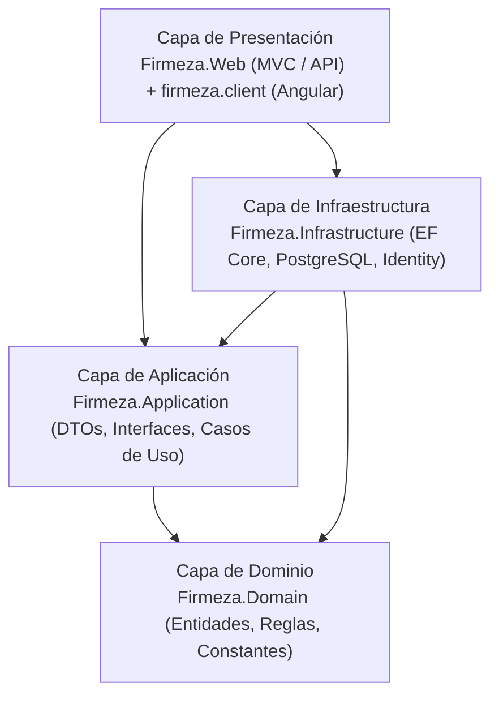
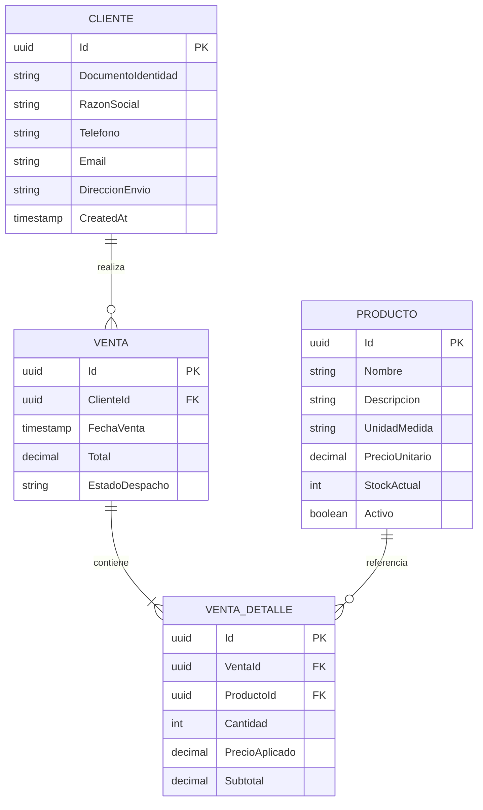
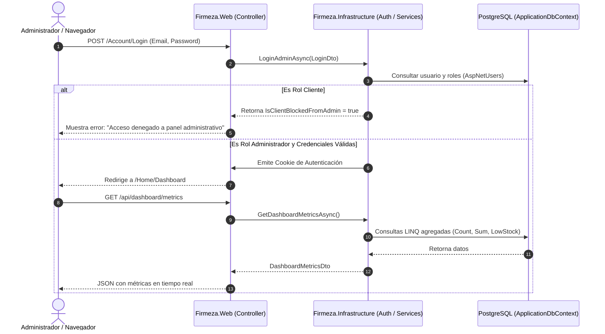

# 🏗️ FIRMEZA - Sistema de Gestión y Despacho de Materiales de Construcción

> **Guía Oficial del Proyecto & Manual de Estudio Arquitectónico**  
> Diseñado para comprender la arquitectura de software, patrones de diseño, flujo de datos, seguridad y ejecución paso a paso de la solución.

---

## 📌 Tabla de Contenidos
1. [Visión General del Proyecto](#-visión-general-del-proyecto)
2. [Arquitectura de la Solución (Clean Architecture)](#-arquitectura-de-la-solución-clean-architecture)
3. [Estructura del Proyecto y Capas](#-estructura-del-proyecto-y-capas)
4. [Modelo de Dominio y Base de Datos](#-modelo-de-dominio-y-base-de-datos)
5. [Seguridad y Control de Acceso (RBAC)](#-seguridad-y-control-de-acceso-rbac)
6. [Frontend Angular (SPA)](#-frontend-angular-spa)
7. [Flujo de Ejecución y Ciclo de Vida de una Petición](#-flujo-de-ejecución-y-ciclo-de-vida-de-una-petición)
8. [Guía de Puesta en Marcha (Instalación y Ejecución)](#-guía-de-puesta-en-marcha-instalación-y-ejecución)
9. [Cuentas y Datos Semilla por Defecto (Seeders)](#-cuentas-y-datos-semilla-por-defecto-seeders)
10. [Preguntas Clave para Defensa y Estudio](#-preguntas-clave-para-defensa-y-estudio)

---

## 🏢 Visión General del Proyecto

**Firmeza** es una plataforma integral desarrollada para empresas del sector de la construcción (ferreterías, distribuidoras y constructoras). Permite gestionar:
- Catálogo de materiales pesados y de construcción (cemento, acero corrugado, áridos, mampostería).
- Registro y trazabilidad de clientes corporativos y particulares.
- Registro de órdenes de venta con control de estados de despacho (`Pendiente`, `En Ruta`, `Entregado`).
- Panel de control administrativo (**Dashboard**) con métricas de ventas en tiempo real, ingresos totales y alertas de inventario bajo.
- Doble interfaz: **Portal Administrativo Razor MVC** y **Cliente SPA desacoplado en Angular**.

---

## 🏛️ Arquitectura de la Solución (Clean Architecture)

El proyecto sigue los principios de **Clean Architecture** (Arquitectura Limpia / Cebolla) y **Domain-Driven Design (DDD)** simplificado.



### 🧠 ¿Por qué esta arquitectura?
* **Independencia del Framework:** La lógica del negocio no está atada a la base de datos ni a la interfaz web.
* **Separación de Responsabilidades (SoC):** Cada proyecto tiene un propósito único y bien delimitado.
* **Mantenibilidad y Escalabilidad:** Es fácil cambiar el proveedor de base de datos (por ejemplo, PostgreSQL por SQL Server) o crear un nuevo cliente móvil sin tocar el núcleo del sistema.

---

## 📂 Estructura del Proyecto y Capas

```text
Firmeza/
│
├── Firmeza.slnx                 # Archivo de solución de .NET
├── README.md                    # Guía de estudio y documentación del proyecto
│
├── src/                         # Backend (.NET 10.0 / C#)
│   ├── Firmeza.Domain/          # Núcleo del negocio (Entidades, Enums, Constantes)
│   │   ├── Entities/            # Cliente, Producto, Venta, VentaDetalle
│   │   ├── Constants/           # Roles (Administrador, Cliente)
│   │   └── Shared/              # BaseEntity (Id, CreatedAt, IsActive)
│   │
│   ├── Firmeza.Application/     # Casos de uso, DTOs e Interfaces
│   │   ├── DTOS/                # LoginDto, RegisterDto, DashboardMetricsDto
│   │   └── Interfaces/          # IAuthService, IDashboardService
│   │
│   ├── Firmeza.Infrastructure/  # Acceso a datos, Identity y Servicios Externos
│   │   ├── Persistence/         # ApplicationDbContext, DataSeeder
│   │   ├── Identity/            # IdentitySeeder, AuthService
│   │   ├── Services/            # DashboardService (Cálculo de métricas EF Core)
│   │   └── Migrations/          # Migraciones de Entity Framework Core
│   │
│   └── Firmeza.Web/             # Capa Web (Controladores MVC, Controladores API)
│       ├── Controllers/         # AccountController, HomeController
│       ├── Controllers/Api/     # DashboardApiController, ClientesApiController, etc.
│       ├── Views/               # Vistas Razor (Login, Register, Dashboard, Index)
│       ├── wwwroot/             # Archivos estáticos y compilado SPA Angular
│       ├── appsettings.json     # Configuración de conexiones PostgreSQL e Identity
│       └── Program.cs           # Punto de entrada, Inyección de Dependencias y Pipeline HTTP
│
└── firmeza.client/              # Frontend desacoplado (Angular 22)
    ├── src/
    │   ├── app/
    │   │   ├── components/      # Sidebar y layout común
    │   │   ├── pages/           # Dashboard, Productos, Clientes, Ventas
    │   │   ├── services/        # DashboardService (Llamadas HTTP hacia la API)
    │   │   └── app.routes.ts    # Configuración de enrutamiento del cliente
    │   └── main.ts              # Bootstrap de Angular
    └── package.json             # Dependencias del frontend
```

---

## 🗄️ Modelo de Dominio y Base de Datos

### Diagrama Entidad-Relación (ER)



### Entidades Destacadas:
1. **`Cliente`:** Almacena la información tributaria y de entrega (NIT/Cédula, Razón Social, Dirección).
2. **`Producto`:** Registra el inventario de materiales (Unidad de Medida, Stock, Precio actual).
3. **`Venta`:** Cabecera de la factura/pedido, con el total y su estado logístico (`Pendiente` ➔ `En Ruta` ➔ `Entregado`).
4. **`VentaDetalle`:** Línea de producto vendida, manteniendo el `PrecioAplicado` histórico al momento de la venta para evitar que cambios futuros en el precio del catálogo alteren la facturación pasada.

---

## 🔐 Seguridad y Control de Acceso (RBAC)

El sistema implementa **Role-Based Access Control (RBAC)** usando **ASP.NET Core Identity** y **Entity Framework Core**.

### Regla de Negocio Crítica: Segregación de Roles
* **Rol `Administrador`**:
  * Acceso al panel web Razor MVC (`/Home/Dashboard`).
  * Acceso a los endpoints administrativos y métricas en `/api/*`.
* **Rol `Cliente`**:
  * Diseñado para el usuario final/comprador en la aplicación cliente (SPA).
  * **Mecanismo de Bloqueo en Razor:** Si un usuario con rol `Cliente` intenta iniciar sesión en el formulario administrativo (`/Account/Login`), el servicio [`AuthService`](file:///home/cohorte-5/Escritorio/Firmeza/src/Firmeza.Infrastructure/Identity/AuthService.cs) activa la bandera `IsClientBlockedFromAdmin = true` y rechaza la sesión con un mensaje explicativo.

```csharp
// Fragmento conceptual del bloqueo en AuthService:
if (await userManager.IsInRoleAsync(user, Roles.Cliente))
{
    return AuthResultDto.Blocked("Acceso no permitido: Esta cuenta tiene rol 'Cliente' y debe usar la aplicación cliente.");
}
```

---

## ⚡ Frontend Angular (SPA)

El proyecto `firmeza.client` es una aplicación moderna desarrollada en **Angular** que consume los servicios REST del backend:
* **Standalone Components:** Arquitectura moderna sin `NgModule`.
* **Módulos y Rutas:**
  * `/dashboard`: Visualiza tarjetas de resumen (Total Ventas, Ingresos acumulados, Total Clientes, Productos con Bajo Stock) y tablas de ventas recientes.
  * `/productos`: Gestión y visualización de inventario con alertas de stock.
  * `/clientes`: Directorio de clientes con NIT y acumulado de compras.
  * `/ventas`: Listado de ventas y seguimiento del estado logístico del despacho.
* **Integración con ASP.NET Core:** Al compilar (`npm run build`), los binarios del frontend se copian a `src/Firmeza.Web/wwwroot/spa`, permitiendo que el servidor .NET los sirva directamente.

---

## 🔄 Flujo de Ejecución y Ciclo de Vida de una Petición



---

## 🚀 Guía de Puesta en Marcha (Instalación y Ejecución)

### Requisitos Previos:
- **.NET SDK 10.0** (o versión superior compatible).
- **Node.js (v18+)** y **npm**.
- **PostgreSQL** (local o remoto).

### 1. Configurar la Base de Datos
Verifica en `src/Firmeza.Web/appsettings.json` la cadena de conexión:
```json
"ConnectionStrings": {
  "DefaultConnection": "Host=...;Port=5432;Database=firmeza_db;Username=...;Password=..."
}
```

### 2. Ejecutar el Backend (con migraciones automáticas y Seeders)
```bash
cd src/Firmeza.Web
dotnet run
```
> **Nota:** Al arrancar, [`Program.cs`](file:///home/cohorte-5/Escritorio/Firmeza/src/Firmeza.Web/Program.cs) ejecuta `dbContext.Database.MigrateAsync()` y si la base de datos está vacía, sembrará automáticamente los roles, usuarios y datos de prueba.

### 3. Ejecutar el Frontend Angular en Modo Desarrollo (Opcional)
```bash
cd firmeza.client
npm install
npm start
```
El cliente estará disponible en `http://localhost:4200/`.

---

## 👥 Cuentas y Datos Semilla por Defecto (Seeders)

Los siguientes datos son creados automáticamente por [`IdentitySeeder`](file:///home/cohorte-5/Escritorio/Firmeza/src/Firmeza.Infrastructure/Identity/IdentitySeeder.cs) y [`DataSeeder`](file:///home/cohorte-5/Escritorio/Firmeza/src/Firmeza.Infrastructure/Persistence/DataSeeder.cs):

### Usuarios de Prueba:
| Rol | Correo Electrónico | Contraseña | Comportamiento en `/Account/Login` |
| :--- | :--- | :--- | :--- |
| **Administrador** | `admin@firmeza.com` | `Admin123*` | Inicia sesión exitosamente y accede al Dashboard |
| **Cliente** | `cliente@firmeza.com` | `Cliente123*` | Se rechaza con advertencia de bloqueo administrativo |

### Materiales Sembrados:
* **Cemento Gris Tipo 1 x 50kg** (Bolsa - $32,000 COP)
* **Varilla Corrugada 1/2"** (Unidad - $45,000 COP)
* **Ladrillo Estructurado Arcilla 10x20x40** (Millar - $1,200,000 COP)
* **Arena Lavada de Río (M3)** (M3 - $85,000 COP)

---

## 🎓 Preguntas Clave para Defensa y Estudio

Prepárate para defender el proyecto dominando estos conceptos:

1. **¿Qué patrón arquitectónico se utilizó y por qué?**
   * *Respuesta:* Clean Architecture dividida en 4 capas (Dominio, Aplicación, Infraestructura, Presentación). Garantiza el desacoplamiento, testabilidad y que la lógica del negocio no dependa de la base de datos ni de librerías externas.

2. **¿Cómo se manejó la inyección de dependencias?**
   * *Respuesta:* En `Firmeza.Infrastructure/DependencyInjection.cs` mediante un método de extensión `AddInfrastructureServices(this IServiceCollection services, IConfiguration config)`, registrando el `DbContext`, `Identity`, y las implementaciones de `IAuthService` y `IDashboardService` con ciclo de vida `Scoped`.

3. **¿Por qué `VentaDetalle` almacena `PrecioAplicado` en lugar de leer siempre el precio de `Producto`?**
   * *Respuesta:* Para mantener la **integridad histórica**. Si el precio de catálogo de un bulto de cemento sube el próximo mes, las ventas realizadas hoy no deben recalcularse ni alterar los balances financieros históricos.

4. **¿Cómo protege el sistema el panel administrativo de usuarios no autorizados?**
   * *Respuesta:* A nivel de backend mediante el filtro `[Authorize(Roles = Roles.Administrador)]` en controladores y acciones, cookies de autenticación `HttpOnly`, y una validación explícita en `AuthService` que rechaza credenciales asociadas al rol `Cliente`.

5. **¿Qué tecnologías componen el Frontend y cómo interactúa con el Backend?**
   * *Respuesta:* Angular 22 con componentes Standalone y servicios HTTP tipados en TypeScript, consumiendo endpoints REST (`/api/dashboard/metrics`, `/api/productos`, `/api/clientes`, `/api/ventas`).

---

*Desarrollado con dedicación técnica y arquitectura de nivel profesional.*
