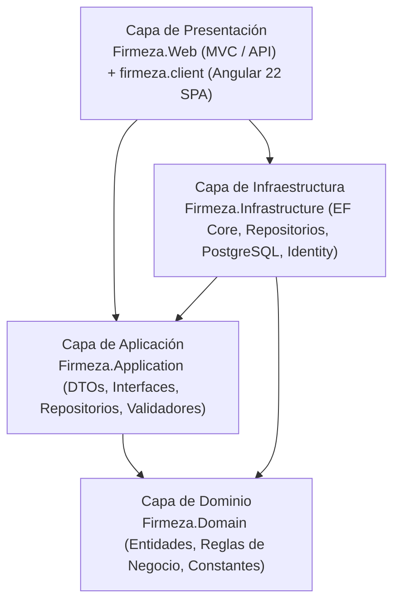
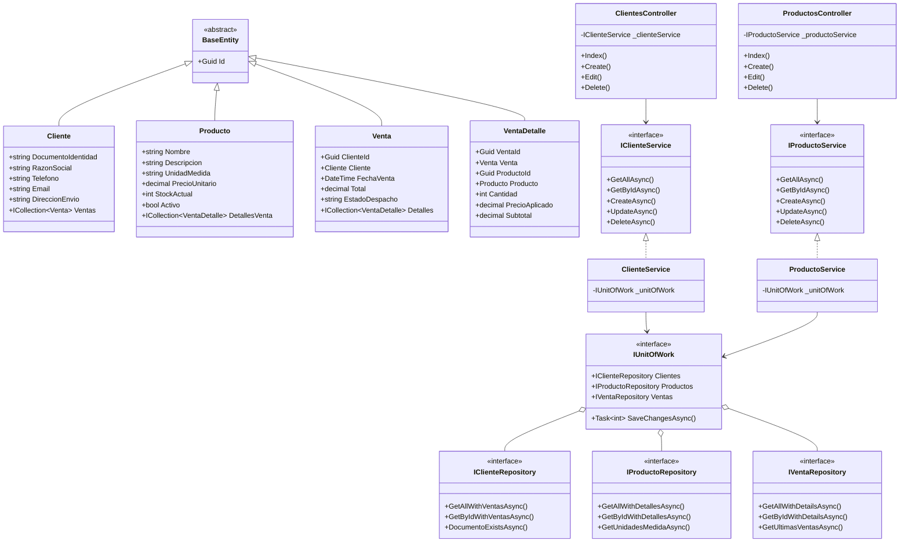
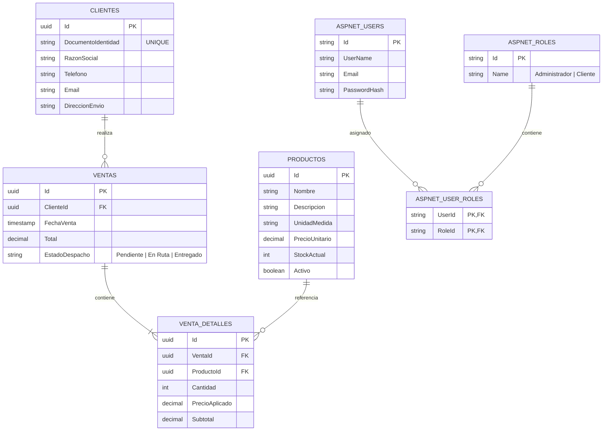
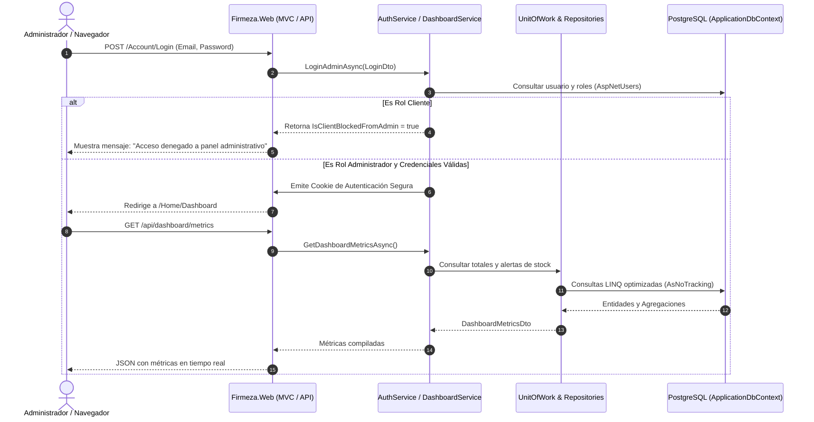
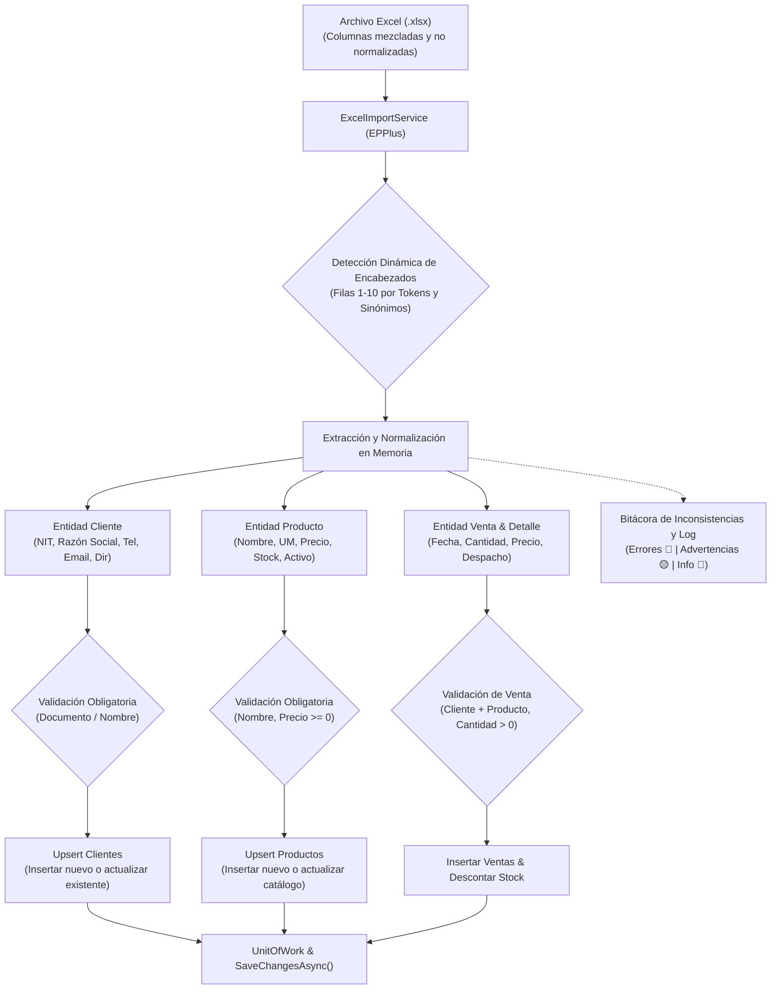
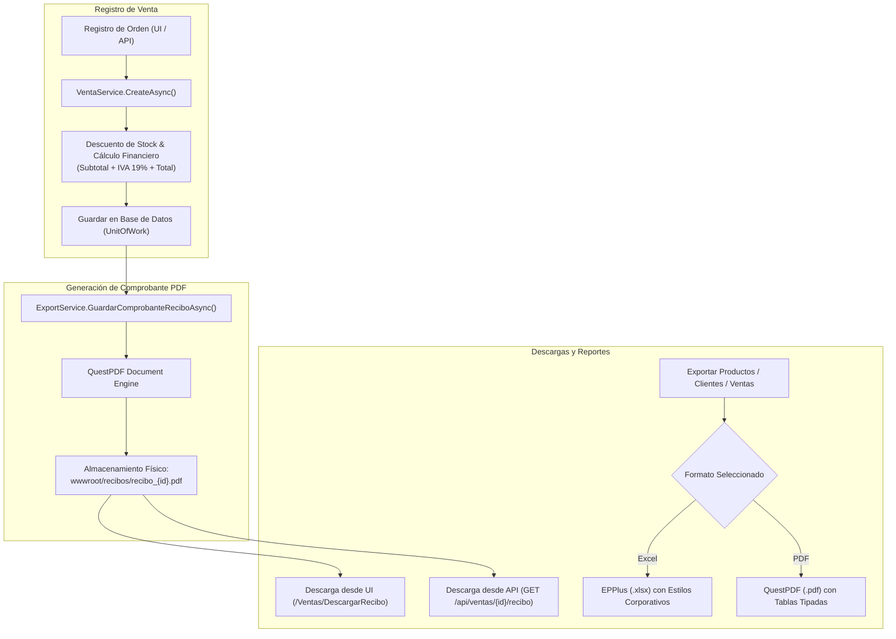

# 🏗️ FIRMEZA - Sistema de Gestión y Despacho de Materiales de Construcción

> **Guía Oficial del Proyecto, Manual de Arquitectura & Guía de Despliegue**  
> Diseñado para comprender en profundidad la arquitectura de software, patrones de diseño, diagramas técnicos (ER y Clases), flujo de datos, seguridad y ejecución tanto en entorno local como en contenedores Docker.

---

## 📌 Tabla de Contenidos
1. [Visión General del Proyecto](#-visión-general-del-proyecto)
2. [Arquitectura de la Solución (Clean Architecture & SOLID)](#-arquitectura-de-la-solución-clean-architecture--solid)
3. [Estructura del Proyecto y Capas](#-estructura-del-proyecto-y-capas)
4. [Diagramas Técnicos de Arquitectura y Diseño](#-diagramas-técnicos-de-arquitectura-y-diseño)
   * [Diagrama de Clases de la Solución](#diagrama-de-clases-de-la-solución)
   * [Diagrama Entidad-Relación (ER) Completo](#diagrama-entidad-relación-er-completo)
   * [Diagrama de Secuencia (Flujo de Autenticación y Dashboard)](#diagrama-de-secuencia-flujo-de-autenticación-y-dashboard)
5. [Patrón Repository y Unit of Work (Acceso a Datos Desacoplado)](#-patrón-repository-y-unit-of-work-acceso-a-datos-desacoplado)
6. [Módulo de Gestión de Productos (CRUD, ViewModels y Filtrado)](#-módulo-de-gestión-de-productos-crud-viewmodels-y-filtrado)
7. [Módulo de Gestión de Clientes (CRUD, Validaciones y Búsqueda)](#-módulo-de-gestión-de-clientes-crud-validaciones-y-búsqueda)
8. [Módulo de Importación y Normalización de Excel con EPPlus](#-módulo-de-importación-y-normalización-de-excel-con-epplus)
9. [Módulo de Exportación de Datos y Comprobantes PDF (QuestPDF & EPPlus)](#-módulo-de-exportación-de-datos-y-comprobantes-pdf-questpdf--epplus)
10. [Manejo de Errores con Try-Catch y Validaciones de Entrada](#-manejo-de-errores-con-try-catch-y-validaciones-de-entrada)
11. [Seguridad y Control de Acceso (RBAC)](#-seguridad-y-control-de-acceso-rbac)
12. [Diseño Visual, UI/UX y Frontend (Header, Sidebar y Footer)](#-diseño-visual-uiux-y-frontend-header-sidebar-y-footer)
13. [Pruebas Unitarias Automatizadas (xUnit & Moq)](#-pruebas-unitarias-automatizadas-xunit--moq)
14. [Guía de Puesta en Marcha (Instalación y Ejecución Local)](#-guía-de-puesta-en-marcha-instalación-y-ejecución-local)
15. [Despliegue y Ejecución con Docker y Docker Compose](#-despliegue-y-ejecución-con-docker-y-docker-compose)
16. [Cuentas y Datos Semilla por Defecto (Seeders)](#-cuentas-y-datos-semilla-por-defecto-seeders)
17. [Banco de Preguntas Clave para Sustentación y Estudio](#-banco-de-preguntas-clave-para-sustentación-y-estudio)

---

## 🏢 Visión General del Proyecto

**Firmeza** es una plataforma integral desarrollada para empresas del sector de la construcción, distribuidores mayoristas de materiales pesados y ferreterías industriales. Permite administrar:
- **Catálogo de Materiales y Productos:** Control de precios unitarios, unidades de medida (Bolsa, M3, Millar, Unidad, Kg), stock en tiempo real y bajas lógicas para conservar balances históricos.
- **Directorio de Clientes:** Gestión de empresas constructoras, contratistas y clientes particulares con validación estricta de Documento/NIT y protección de integridad referencial.
- **Registro y Despacho de Ventas:** Trazabilidad de órdenes con estados de entrega (`Pendiente`, `En Ruta`, `Entregado`) y congelación de precios históricos de venta.
- **Panel Administrativo (Dashboard):** Métricas operativas en tiempo real (facturación total acumulada, órdenes por estado y alertas de inventario bajo `< 50` unidades).
- **Doble Experiencia de Usuario:** Interfaz web enriquecida con **ASP.NET Core Razor MVC** y cliente interactivo desacoplado en **Angular 22 (SPA)**.

---

## 🏛️ Arquitectura de la Solución (Clean Architecture & SOLID)

El proyecto sigue rigurosamente los principios de **Clean Architecture** (Arquitectura Limpia / Onion Architecture) y **Domain-Driven Design (DDD)** simplificado.



### 🧠 Principios y Ventajas de la Arquitectura:
1. **Independencia de Frameworks y Base de Datos:** Las reglas de negocio no conocen PostgreSQL ni ASP.NET; están aisladas en `Domain` y `Application`.
2. **Inversión de Dependencias (DIP):** Las capas internas definen las interfaces (contratos de repositorios y servicios) y las capas externas (`Infrastructure`) las implementan.
3. **Separación de Responsabilidades (SoC):** Cada proyecto resuelve una única preocupación técnica (Dominio, Casos de Uso, Persistencia o UI).
4. **Alta Testabilidad (Mocking):** Los servicios consumen `IUnitOfWork` e `IRepository`, facilitando pruebas unitarias sin tocar la base de datos real.

---

## 📂 Estructura del Proyecto y Capas

```text
Firmeza/
│
├── Dockerfile                   # Dockerfile Multi-stage (Node/Angular + .NET 10 Runtime)
├── docker-compose.yml           # Orquestación de Contenedores (Web + PostgreSQL 16)
├── Firmeza.slnx                 # Archivo de solución .NET
├── README.md                    # Documentación oficial y manual técnico
│
├── src/                         # Backend (.NET 10.0 / C# 13)
│   ├── Firmeza.Domain/          # Núcleo del Negocio (Cero dependencias externas)
│   │   ├── Entities/            # Cliente, Producto, Venta, VentaDetalle
│   │   ├── Constants/           # Roles (Administrador, Cliente)
│   │   └── Shared/              # BaseEntity (Id)
│   │
│   ├── Firmeza.Application/     # Casos de Uso, DTOs y Contratos
│   │   ├── DTOS/                # Clientes, Productos, Ventas, Dashboard, Auth, Importacion
│   │   │   ├── Ventas/          # VentaDto, VentaDetalleDto, CreateVentaDto, VentaFilterDto
│   │   │   └── Importacion/     # ExcelImportOptionsDto, ExcelImportResultDto, ExcelImportErrorDto
│   │   ├── Interfaces/          # IAuthService, IDashboardService, IClienteService, IProductoService, IVentaService, IExportService, IExcelImportService
│   │   │   └── Repositories/    # IBaseRepository, IClienteRepository, IProductoRepository, IVentaRepository, IUnitOfWork
│   │   └── Validators/          # ValidadorEdad (Validaciones con try-catch diferenciado)
│   │
│   ├── Firmeza.Infrastructure/  # Acceso a Datos, Repositorios y Servicios Externos
│   │   ├── Persistence/         # ApplicationDbContext, DataSeeder, Configuraciones EF Core
│   │   ├── Repositories/        # BaseRepository, ClienteRepository, ProductoRepository, VentaRepository, UnitOfWork
│   │   ├── Services/            # ClienteService, ProductoService, VentaService, ExportService (QuestPDF/EPPlus), DashboardService, ExcelImportService (EPPlus)
│   │   ├── Identity/            # IdentitySeeder, AuthService (ASP.NET Core Identity & RBAC)
│   │   └── DependencyInjection.cs # Registro de dependencias en contenedor IoC
│   │
│   └── Firmeza.Web/             # Capa de Presentación Web (MVC y API REST)
│       ├── Controllers/         # ClientesController, ProductosController, VentasController, HomeController, AccountController, ImportacionController
│       ├── Controllers/Api/     # ClientesApiController, ProductosApiController, VentasApiController, DashboardApiController, ImportacionApiController
│       ├── Views/               # Vistas Razor (Clientes, Productos, Ventas, Importacion, Home, Account)
│       ├── Models/              # ViewModels (ClienteIndexViewModel, ProductoIndexViewModel)
│       ├── wwwroot/             # Archivos estáticos, CSS/JS, recibos (/wwwroot/recibos) y SPA Angular (/wwwroot/spa)
│       ├── appsettings.json     # Conexión a PostgreSQL e Identity
│       └── Program.cs           # Pipeline HTTP, CORS, Autenticación y Middleware
│
├── tests/                       # Pruebas Automatizadas
│   └── Firmeza.UnitTests/       # Proyecto de Pruebas Unitarias (xUnit & Moq)
│       ├── Domain/              # ProductoEntityTests, VentaDetalleEntityTests
│       ├── Application/         # ValidadorEdadTests
│       ├── Services/            # ClienteServiceTests, ProductoServiceTests, VentaServiceTests, ExportServiceTests, ExcelImportServiceTests
│       └── Controllers/         # VentasControllerTests, ImportacionControllerTests
│
└── firmeza.client/              # Frontend Desacoplado (Angular 22 SPA)
    ├── src/
    │   ├── app/
    │   │   ├── components/      # SidebarComponent, HeaderComponent, FooterComponent
    │   │   ├── pages/           # Dashboard, Productos, Clientes, Ventas
    │   │   ├── services/        # DashboardService (Cliente HTTP hacia APIs REST)
    │   │   └── app.routes.ts    # Enrutamiento de la SPA
    │   └── main.ts              # Bootstrap de Angular
    └── package.json             # Dependencias del cliente web
```

---

## 📊 Diagramas Técnicos de Arquitectura y Diseño

### Diagrama de Clases de la Solución



---

### Diagrama Entidad-Relación (ER) Completo

Incluye las tablas del dominio comercial y las tablas de seguridad de **ASP.NET Core Identity**:



---

### Diagrama de Secuencia (Flujo de Autenticación y Dashboard)



---

## 🗄️ Patrón Repository y Unit of Work (Acceso a Datos Desacoplado)

### 📌 ¿Qué hace la carpeta `Repositories`?
La carpeta **`Repositories`** (ubicada en `Firmeza.Infrastructure/Repositories`) implementa el **Patrón Repositorio**, el cual actúa como mediador entre la persistencia (`ApplicationDbContext` / EF Core) y los servicios de aplicación (`Services`).

### 🎯 Beneficios Arquitectónicos:
1. **Desacoplamiento Absoluto:** Los servicios (`ClienteService`, `ProductoService`) y controladores no tienen referencias a LINQ ni al `DbContext` directamente.
2. **Inversión de Dependencias (DIP):** Los contratos se declaran en `Firmeza.Application/Interfaces/Repositories/` y las implementaciones concretas en `Firmeza.Infrastructure/Repositories/`.
3. **Unidad de Trabajo (Unit of Work):** Coordina múltiples repositorios asegurando que todas las operaciones de inserción, actualización o eliminación se ejecuten en una única transacción atómica con `SaveChangesAsync()`.

| Contrato (`Application`) | Implementación (`Infrastructure`) | Responsabilidad |
| :--- | :--- | :--- |
| `IBaseRepository<T>` | `BaseRepository<T>` | Operaciones CRUD genéricas (`GetByIdAsync`, `GetAllAsync`, `AddAsync`, `UpdateAsync`, `DeleteAsync`, `ExistsAsync`). |
| `IClienteRepository` | `ClienteRepository` | Consultas con historial de ventas, validación de unicidad de NIT y filtros avanzados. |
| `IProductoRepository` | `ProductoRepository` | Catálogo de materiales, unidades de medida y alertas de inventario. |
| `IVentaRepository` | `VentaRepository` | Órdenes históricas con desglose de productos y clientes asociados. |
| `IUnitOfWork` | `UnitOfWork` | Agrupa todos los repositorios y controla el guardado atómico transaccional. |

---

## 📦 Módulo de Gestión de Productos (CRUD, ViewModels y Filtrado)

* **Crear (`Create`):** Registro de nuevos materiales con validación de precios positivos, unidades de medida y stock inicial.
* **Consultar (`Index` y `Details`):** Vista de catálogo con filtros por unidad de medida, estado activo/inactivo, alerta de stock bajo (`< 50`) y ordenamiento multi-criterio.
* **Actualizar (`Edit`):** Modificación de especificaciones y precios de catálogo.
* **Eliminar / Desactivar (`Delete`):** Lógica de **integridad histórica**. Si el producto ya cuenta con ventas asociadas, se realiza un **Soft Delete** (`Activo = false`) para proteger los reportes contables del pasado; si no tiene ventas, se elimina físicamente.

---

## 👥 Módulo de Gestión de Clientes (CRUD, Validaciones y Búsqueda)

* **Crear (`Create`):** Registro de constructoras y clientes con validación estricta de formato y unicidad de Documento/NIT.
* **Consultar (`Index` y `Details`):** Listado con canales de contacto, dirección de despacho y acumulado histórico de facturación.
* **Actualizar (`Edit`):** Edición de información de contacto validando que no se duplique el NIT con otro cliente.
* **Eliminar (`Delete`):** Protección referencial. Si el cliente tiene ventas registradas (`totalCompras > 0`), el sistema **bloquea la eliminación** para salvaguardar la trazabilidad fiscal.

---

---

## 📊 Módulo de Importación y Normalización de Excel con EPPlus

El sistema integra un motor avanzado de procesamiento de archivos **Excel (.xlsx / .xls)** utilizando la librería **EPPlus**, diseñado específicamente para resolver el problema de hojas de cálculo **no normalizadas, con datos desorganizados o columnas mezcladas** provenientes de sistemas externos, exportaciones heterogéneas o planillas manuales de clientes y proveedores.



### 🧠 Capacidades y Lógica de Normalización:

1. **Detección Dinámica de Encabezados y Mapeo Flexible:**
   - Examina las primeras 10 filas de cada hoja para identificar la fila real de encabezados, permitiendo archivos que contengan títulos o metadatos superiores.
   - Diccionario semántico tolerante a tildes, mayúsculas, guiones y barras (`/`):
     - **Clientes:** `nit`, `cedula`, `documento`, `id_cliente`, `razon_social`, `nombre_cliente`, `empresa`, `telefono`, `celular`, `direccion_envio`, `email`, `correo`.
     - **Productos:** `producto`, `articulo`, `material`, `item`, `descripcion`, `unidad_medida`, `u.m.`, `precio_unitario`, `stock_actual`, `disponible`, `activo`.
     - **Ventas y Detalles:** `cantidad_vendida`, `cant`, `unidades`, `precio_aplicado`, `precio_venta`, `fecha_venta`, `estado_despacho`, `nro_factura`, `referencia`.

2. **División y Relacionamiento en Memoria:**
   - Si una sola fila contiene datos del cliente (ej. *Constructora Bolívar*), datos del producto (ej. *Cemento Gris Argos 50kg*) y datos de la venta (ej. *150 bultos el 2026-10-01*), el motor los extrae, valida y estructura en memoria vinculando las llaves foráneas (`ClienteId`, `ProductoId`, `VentaId`) de manera automática.
   - Deduplica clientes y productos en memoria para evitar colisiones antes del guardado.

3. **Validación de Datos Obligatorios y Normalización de Formatos:**
   - Limpieza automática de símbolos de moneda (`$`, `€`, `COP`, `USD`), puntos y comas decimales/miles (`1,250.50` vs `1.250,50`).
   - Soporte para fechas en formatos de texto estándar (`dd/MM/yyyy`, `yyyy-MM-dd`) y números de serie serializados de Excel (`OADate`).
   - Exigencia de campos obligatorios:
     - Nombre de producto no vacío y precio no negativo.
     - Documento de identidad o razón social de cliente.
     - Cantidades de venta estrictamente mayores a cero.

4. **Estrategia de Inserción o Actualización (Upsert) y Control de Stock:**
   - **Clientes:** Si ya existe por NIT en la base de datos o en el lote actual, actualiza teléfonos, correos y direcciones; si no, lo registra como nuevo.
   - **Productos:** Si ya existe por nombre de material, actualiza su precio unitario y ajusta el inventario según los parámetros elegidos.
   - **Ventas:** Registra la orden de despacho, congela el precio histórico aplicado y descuenta automáticamente el inventario disponible.

5. **Bitácora Detallada de Inconsistencias y Errores:**
   - Reporte con métricas completas (`ClientesCreados`, `ClientesActualizados`, `ProductosCreados`, `VentasCreadas`, `MontoTotalVentas`).
   - Tabla de bitácora clasificada por severidad:
     - **Error 🔴:** Registros que violan integridad (ej. producto sin nombre, venta sin cliente).
     - **Advertencia 🟡:** Ajustes automáticos aplicados (ej. precio negativo ajustado a $0, email malformado, stock insuficiente).
     - **Info 🔵:** Mapeo de columnas y resumen de ejecución.

6. **Interfaz Web (Razor MVC) y API REST:**
   - **Vista Web (`/Importacion`):** Área de carga con Drag & Drop, interruptores configurables (*Upsert*, *Crear ventas*, *Descontar inventario*), KPIs en tiempo real y tabla interactiva de errores.
   - **Plantilla de Ejemplo:** Botón para descargar un `.xlsx` preconstruido con ejemplos de datos desorganizados y tablas mixtas para pruebas inmediatas.
   - **Endpoint REST:** `POST /api/importacion/excel` (`multipart/form-data`) y `GET /api/importacion/plantilla`.

---

## 📄 Módulo de Exportación de Datos y Comprobantes PDF (QuestPDF & EPPlus)

El sistema cuenta con un motor integral de exportación y generación documental que permite emitir reportes en formatos **Excel (.xlsx)** y **PDF (.pdf)** para todos los módulos clave (**Productos, Clientes y Ventas**), así como la **generación automática de recibos/comprobantes oficiales en PDF** al registrar cada venta en el sistema.



### 🧾 Características de los Comprobantes de Venta en PDF:
1. **Disparador Automático:** Cada vez que se crea una venta (desde la interfaz Razor MVC `/Ventas/Create`, desde el proceso de importación masiva o desde el endpoint REST `POST /api/ventas`), el sistema invoca `IExportService.GuardarComprobanteReciboAsync` generando el documento sin intervención manual.
2. **Estructura Oficial del Recibo:**
   - **Encabezado Corporativo:** Logotipo/Marca "FIRMEZA", NIT empresarial, dirección, teléfono y correo de soporte.
   - **Metadatos de la Orden:** Número oficial consecutivo `#VENTA-{Id}`, fecha y hora exacta de expedición, estado de despacho (`Pendiente`, `En Ruta`, `Entregado`).
   - **Datos Completos del Cliente:** Razón Social / Nombre, Documento de Identidad / NIT, teléfono, correo electrónico y dirección de entrega.
   - **Desglose Detallado de Productos:** Tabla con columnas de Cantidad, Unidad de Medida, Descripción del Material, Precio Unitario y Subtotal por ítem.
   - **Liquidación Financiera e Impuestos:**
     - **Subtotal Base:** Base imponible gravada calculada de forma exacta (`Total / 1.19`).
     - **IVA (19%):** Impuesto al valor agregado discriminado (`Total - SubtotalBase`).
     - **Total General:** Valor total a pagar en Pesos Colombianos (COP).
   - **Pie de Página y Trazabilidad:** Mensaje de validez legal, paginación y fecha de generación del reporte.
3. **Almacenamiento Físico Persistente:**
   - Se guardan en el directorio `wwwroot/recibos/` bajo la convención `recibo_{ventaId}.pdf`.
   - Si la carpeta `wwwroot/recibos` no existe, se crea automáticamente en tiempo de ejecución.
4. **Acceso y Descarga Directa:**
   - Botón directo de **Descargar Recibo (PDF)** en las vistas de listado (`/Ventas`), detalle (`/Ventas/Details/{id}`) y formularios.
   - Endpoint REST: `GET /api/ventas/{id}/recibo` con cabecera `Content-Disposition: inline; filename=recibo_{id}.pdf`.

---

### 📊 Módulo de Exportación General (Excel & PDF):

| Módulo | Formatos Disponibles | Ruta MVC | Endpoint API | Contenido Exportado |
| :--- | :--- | :--- | :--- | :--- |
| **Productos** | Excel (`.xlsx`) & PDF (`.pdf`) | `/Productos/ExportarExcel`<br/>`/Productos/ExportarPdf` | `GET /api/productos/exportar/excel`<br/>`GET /api/productos/exportar/pdf` | ID, Nombre, Descripción, Unidad de Medida, Precio Unitario, Stock Actual y Estado Activo/Inactivo. |
| **Clientes** | Excel (`.xlsx`) & PDF (`.pdf`) | `/Clientes/ExportarExcel`<br/>`/Clientes/ExportarPdf` | `GET /api/clientes/exportar/excel`<br/>`GET /api/clientes/exportar/pdf` | ID, Documento/NIT, Razón Social, Teléfono, Email, Dirección de Envío y Total Compras. |
| **Ventas** | Excel (`.xlsx`) & PDF (`.pdf`) | `/Ventas/ExportarExcel`<br/>`/Ventas/ExportarPdf` | `GET /api/ventas/exportar/excel`<br/>`GET /api/ventas/exportar/pdf` | ID, Fecha, Cliente (NIT y Nombre), Cantidad de Ítems, Total Facturado y Estado de Despacho. |

---

## 🛡️ Manejo de Errores con Try-Catch y Validaciones de Entrada

La capa de aplicación implementa manejo defensivo de excepciones mediante [`ValidadorEdad`](file:///home/cohorte-5/Escritorio/Firmeza/src/Firmeza.Application/Validators/ValidadorEdad.cs), aplicando bloques `try-catch` con captura de excepciones tipadas:
1. **`FormatException`:** Captura texto no numérico ingresado en campos enteros.
2. **`OverflowException`:** Captura valores fuera del rango permitido de un entero de 32 bits.
3. **`Exception` General:** Captura errores inesperados, retornando siempre mensajes claros y amigables al usuario que se reflejan en el `ModelState` y en las vistas Razor.

---

## 🔐 Seguridad y Control de Acceso (RBAC)

* **Rol `Administrador`:** Acceso exclusivo al panel administrativo Razor MVC (`/Home/Dashboard`, `/Productos`, `/Clientes`, `/Ventas`, `/Importacion`).
* **Rol `Cliente`:** Diseñado para compras desde la aplicación cliente. Si un usuario con rol `Cliente` intenta ingresar al panel administrativo, [`AuthService`](file:///home/cohorte-5/Escritorio/Firmeza/src/Firmeza.Infrastructure/Identity/AuthService.cs) activa la bandera `IsClientBlockedFromAdmin = true` y bloquea el acceso de inmediato.

---

## 🎨 Diseño Visual, UI/UX y Frontend (Header, Sidebar y Footer)

Tanto en **ASP.NET Core Razor MVC** como en **Angular SPA**, la experiencia de usuario mantiene un diseño profesional y coherente:
1. **Encabezado Superior (Header):** Identidad del sistema, estado en tiempo real del servidor (`Servidor / API Conectada`), avatar del usuario y menú desplegable de perfil.
2. **Navegación Lateral (Sidebar):** Menú lateral estilizado con fondo oscuro (`#0f172a`), íconos vectoriales modernos, enlaces activos en azul corporativo (`#2563eb`), acceso directo a ventas, reportes e importación Excel y toggle responsivo para dispositivos móviles.
3. **Pie de Página (Footer):** Barra de cierre con información legal, políticas y versión del sistema.
4. **Paleta de Colores y Tipografía:**
   * Primario: `#2563eb` (Royal Blue)
   * Superficies Oscuras: `#0f172a` y `#1e293b`
   * Fondo de Contenido: `#f8fafc` (Slate 50)
   * Tipografía: `system-ui`, `-apple-system`, `Roboto`, `Helvetica Neue`.

---

## 🧪 Pruebas Unitarias Automatizadas (xUnit & Moq)

El proyecto cuenta con una suite de **48 pruebas unitarias automatizadas** en [`tests/Firmeza.UnitTests/`](file:///home/cohorte-5/Escritorio/Firmeza/tests/Firmeza.UnitTests) utilizando **xUnit** (framework de pruebas oficial y líder en el ecosistema .NET) y **Moq** (librería de aislamiento y dobles de prueba/mocking).

### 🎯 ¿Qué es xUnit y por qué se utiliza?
* **xUnit.net** es un framework de pruebas moderno, extensible y orientado a la programación orientada a objetos para C# y .NET.
* Permite validar de forma rápida y reproducible que las reglas de negocio y los componentes del sistema funcionen con exactitud sin necesidad de levantar un servidor web ni conectar una base de datos real.

### 📐 Estructura de las Pruebas: Patrón AAA (Arrange - Act - Assert)
Cada método de prueba sigue el estándar internacional **AAA**:
1. **Arrange (Organizar / Preparar):** Inicializa variables, entidades y configura los mocks de dependencias.
2. **Act (Actuar / Ejecutar):** Invoca el método, validador o servicio bajo prueba.
3. **Assert (Afirmar / Verificar):** Comprueba mediante aserciones (`Assert.Equal`, `Assert.True`, `Assert.ThrowsAsync`, etc.) que el resultado coincida exactamente con lo esperado.

### 🧩 Tipos de Pruebas en xUnit:
* **`[Fact]`:** Pruebas con condiciones e invariantes fijas que siempre deben cumplirse.
* **`[Theory]`:** Pruebas parametrizadas ejecutadas con múltiples conjuntos de datos (`[InlineData(...)]`) para verificar casos límite, datos válidos y datos erróneos en una sola prueba.

### 📦 Batería de Pruebas Implementadas (48 Pruebas):

| Proyecto / Capa | Archivo de Prueba | Escenarios Validados |
| :--- | :--- | :--- |
| **Dominio (`Domain`)** | [`ProductoEntityTests.cs`](file:///home/cohorte-5/Escritorio/Firmeza/tests/Firmeza.UnitTests/Domain/ProductoEntityTests.cs) | Inicialización correcta de propiedades de producto y evaluación del umbral de alerta de bajo stock (`Stock < 50`). |
| **Dominio (`Domain`)** | [`VentaDetalleEntityTests.cs`](file:///home/cohorte-5/Escritorio/Firmeza/tests/Firmeza.UnitTests/Domain/VentaDetalleEntityTests.cs) | Cálculo de subtotal histórico multiplicando `Cantidad * PrecioAplicado` congelado al momento de la venta. |
| **Aplicación (`Application`)** | [`ValidadorEdadTests.cs`](file:///home/cohorte-5/Escritorio/Firmeza/tests/Firmeza.UnitTests/Application/ValidadorEdadTests.cs) | Validación con `try-catch`, captura de `FormatException` (texto alfabético), `OverflowException` (números que exceden Int32) y rangos laborales. |
| **Servicios (`Infrastructure`)** | [`ClienteServiceTests.cs`](file:///home/cohorte-5/Escritorio/Firmeza/tests/Firmeza.UnitTests/Services/ClienteServiceTests.cs) | Aislamiento con `Mock<IUnitOfWork>`. Verifica que `DeleteAsync` arroje `InvalidOperationException` si el cliente tiene compras, y borre limpiamente si no las tiene. |
| **Servicios (`Infrastructure`)** | [`ProductoServiceTests.cs`](file:///home/cohorte-5/Escritorio/Firmeza/tests/Firmeza.UnitTests/Services/ProductoServiceTests.cs) | Aislamiento con `Mock<IUnitOfWork>`. Valida que al eliminar un producto con ventas asociadas se aplique **Soft Delete** (`Activo = false`), y que `CreateAsync` registre y confirme cambios. |
| **Servicios (`Infrastructure`)** | [`VentaServiceTests.cs`](file:///home/cohorte-5/Escritorio/Firmeza/tests/Firmeza.UnitTests/Services/VentaServiceTests.cs) | Creación de ventas, cálculo financiero (Subtotal, IVA 19%, Total), descuento automático de existencias en inventario, validaciones de stock insuficiente y almacenamiento físico de comprobantes PDF. |
| **Servicios (`Infrastructure`)** | [`ExportServiceTests.cs`](file:///home/cohorte-5/Escritorio/Firmeza/tests/Firmeza.UnitTests/Services/ExportServiceTests.cs) | Exportación a Excel (EPPlus) y PDF (QuestPDF) para productos, clientes y ventas, generación de bytes de recibo PDF y guardado físico en disco en `wwwroot/recibos/`. |
| **Servicios (`Infrastructure`)** | [`ExcelImportServiceTests.cs`](file:///home/cohorte-5/Escritorio/Firmeza/tests/Firmeza.UnitTests/Services/ExcelImportServiceTests.cs) | Validación con EPPlus: normalización en memoria de columnas mixtas, deduplicación y vinculación de ventas/detalles, upsert de clientes y productos, detección de encabezados desplazados y log de inconsistencias. |
| **Controladores (`Web`)** | [`VentasControllerTests.cs`](file:///home/cohorte-5/Escritorio/Firmeza/tests/Firmeza.UnitTests/Controllers/VentasControllerTests.cs) | Flujos MVC de `Index` con métricas, `Details`, `Create` GET/POST, exportaciones Excel/PDF y descarga de recibos con aislamiento de servicios. |
| **Controladores (`Web`)** | [`ImportacionControllerTests.cs`](file:///home/cohorte-5/Escritorio/Firmeza/tests/Firmeza.UnitTests/Controllers/ImportacionControllerTests.cs) | Validación de archivos subidos, soporte `.xlsx`/`.xls`, procesamiento con opciones de importación y descarga de plantilla. |

### ⚡ Comando para Ejecutar las Pruebas:
```bash
dotnet test
```
> Ejecuta todas las pruebas unitarias y genera el reporte de éxito en la terminal.

---

## 🚀 Guía de Puesta en Marcha (Instalación y Ejecución Local)

### Requisitos Previos:
- **.NET SDK 10.0** (o versión superior compatible).
- **Node.js (v18+)** y **npm**.
- **PostgreSQL (v14+)** en ejecución.

### 1. Configurar la Conexión a Base de Datos
Edita `src/Firmeza.Web/appsettings.json`:
```json
"ConnectionStrings": {
  "DefaultConnection": "Host=localhost;Port=5432;Database=firmeza_db;Username=postgres;Password=tu_password"
}
```

### 2. Ejecutar el Backend (.NET Web API & MVC)
```bash
cd src/Firmeza.Web
dotnet run
```
> **Nota:** Al iniciar, [`Program.cs`](file:///home/cohorte-5/Escritorio/Firmeza/src/Firmeza.Web/Program.cs) ejecuta automáticamente `dbContext.Database.MigrateAsync()` y si la base de datos está vacía, sembrará los roles, usuarios y el catálogo de prueba.

### 3. Ejecutar el Frontend Angular en Modo Desarrollo (Opcional)
```bash
cd firmeza.client
npm install
npm start
```
El cliente estará disponible en `http://localhost:4200/`.

---

## 🐳 Despliegue y Ejecución con Docker y Docker Compose

El proyecto incluye soporte nativo para contenedores mediante un **`Dockerfile` multi-stage** y un archivo **`docker-compose.yml`** que orquesta el backend web y la base de datos PostgreSQL en un entorno aislado.

### 1. Estructura de Contenedores
* **`firmeza-postgres-db`:** Servidor PostgreSQL 16 Alpine con volumen persistente (`postgres_data`) y healthcheck automático.
* **`firmeza-web-app`:** Contenedor .NET 10 en producción con la SPA de Angular precompilada y servida internamente en el puerto `8080` (mapeado a `5000` en el host).

### 2. Comandos de Despliegue con Docker Compose

```bash
# 1. Construir imágenes y levantar servicios en segundo plano
docker-compose up --build -d

# 2. Verificar el estado de los contenedores
docker-compose ps

# 3. Ver los logs en tiempo real del backend y la base de datos
docker-compose logs -f firmeza-web

# 4. Detener los servicios
docker-compose down
```

Una vez levantado, accede desde tu navegador a:
* **Panel Web Administrativo:** `http://localhost:5000`
* **Cliente SPA Angular:** `http://localhost:5000/spa/index.html`

---

## 👥 Cuentas y Datos Semilla por Defecto (Seeders)

### Usuarios de Prueba Preconfigurados:
| Rol | Correo Electrónico | Contraseña | Comportamiento en `/Account/Login` |
| :--- | :--- | :--- | :--- |
| **Administrador** | `admin@firmeza.com` | `Admin123*` | Inicia sesión exitosamente y accede al Dashboard |
| **Cliente** | `cliente@firmeza.com` | `Cliente123*` | Se rechaza con advertencia de bloqueo administrativo |

### Materiales Sembrados en Base de Datos:
* **Cemento Gris Tipo 1 x 50kg** (Bolsa - $32,000 COP)
* **Varilla Corrugada 1/2"** (Unidad - $45,000 COP)
* **Ladrillo Estructurado Arcilla 10x20x40** (Millar - $1,200,000 COP)
* **Arena Lavada de Río (M3)** (M3 - $85,000 COP)

---

## 🎓 Banco de Preguntas Clave para Sustentación y Estudio

1. **¿Qué patrón arquitectónico se utilizó y por qué?**
   * *Respuesta:* Clean Architecture en 4 capas (Domain, Application, Infrastructure, Presentation). Garantiza que el núcleo del negocio sea independiente de frameworks, bases de datos e interfaces de usuario.
2. **¿Qué rol cumplen la carpeta `Repositories` y `Unit of Work`?**
   * *Respuesta:* Desacoplan los servicios de Entity Framework Core. Las interfaces están en `Application` (Inversión de Dependencias) y las implementaciones en `Infrastructure/Repositories`. `Unit of Work` agrupa las operaciones asegurando confirmación atómica con `SaveChangesAsync()`.
3. **¿Cómo se protegen los registros históricos al eliminar productos o clientes?**
   * *Respuesta:* Para productos con ventas previas se aplica **Soft Delete** (`Activo = false`). Para clientes con facturas registradas, el sistema restringe el borrado físico para preservar la trazabilidad fiscal.
4. **¿Por qué `VentaDetalle` almacena `PrecioAplicado`?**
   * *Respuesta:* Para congelar el precio unitario del momento de la compra; si el precio de catálogo cambia a futuro, los balances históricos no se alteran.
5. **¿Cómo maneja el sistema la segregación de roles (RBAC)?**
   * *Respuesta:* Mediante ASP.NET Core Identity y el filtro `[Authorize(Roles = Roles.Administrador)]`. `AuthService` bloquea explícitamente el acceso de cuentas con rol `Cliente` al panel administrativo.
6. **¿Cómo se realiza el despliegue en Docker?**
   * *Respuesta:* Con un `Dockerfile` multi-stage que compila la SPA de Angular (Node.js) y la inyecta en el `wwwroot` de la aplicación .NET 10. `docker-compose.yml` orquesta la base de datos PostgreSQL con healthcheck y conecta el contenedor web en una red privada.
7. **¿Cómo se aplican las pruebas unitarias con xUnit y Moq en el proyecto?**
   * *Respuesta:* Mediante el proyecto `tests/Firmeza.UnitTests`, aplicando el patrón AAA (Arrange, Act, Assert). Se prueban entidades del dominio (cálculo de subtotales, reglas de stock), validadores de aplicación (`ValidadorEdad` con captura de excepciones) y servicios de infraestructura (`ClienteService`, `ProductoService`, `VentaService`, `ExportService`, `ExcelImportService`) aislando la base de datos con `Mock<IUnitOfWork>` y base en memoria.
8. **¿Cómo funciona el motor de importación y normalización automática de Excel con EPPlus?**
   * *Respuesta:* Utiliza `ExcelImportService` para procesar archivos `.xlsx` desorganizados o con columnas mezcladas. Detecta dinámicamente encabezados en las primeras 10 filas usando sinónimos y tokens; divide la fila en entidades relacionales (`Cliente`, `Producto`, `Venta`, `VentaDetalle`) en memoria; valida campos obligatorios y formatos (moneda, fechas, correo); ejecuta operaciones de *Upsert* (actualiza si existe o crea nuevo) y genera una bitácora clasificada por severidad (`Error`, `Advertencia`, `Info`).
9. **¿Cómo funciona el módulo de exportación de datos y la generación automática de comprobantes de venta en PDF con QuestPDF y EPPlus?**
   * *Respuesta:* A través de `ExportService` e `IVentaService`. Al registrar cualquier venta, `VentaService` calcula el subtotal y el IVA discriminado al 19%, descuenta inventario y solicita a `ExportService` generar un comprobante oficial con QuestPDF estructurado con encabezado de la empresa, datos del cliente, tabla de ítems y totales. El PDF se almacena automáticamente en `wwwroot/recibos/recibo_{id}.pdf` y queda disponible para descarga inmediata desde la interfaz web (`/Ventas/DescargarRecibo/{id}`) y API REST (`/api/ventas/{id}/recibo`). Adicionalmente, permite exportar catálogos completos de Productos, Clientes y Ventas tanto a Excel con estilos (EPPlus) como a reportes formales en PDF (QuestPDF).

---

*Desarrollado con arquitectura de software limpia, código tipado y documentación de nivel profesional.*
